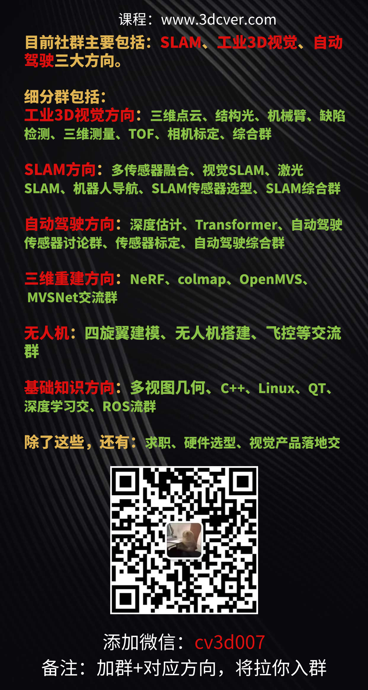

这里主要汇总计算机视觉、3D视觉、VSLAM、点云、三维重建、深度学习、结构光、机械臂抓取等方向的最新论文，主要来源：公众号【3D视觉工坊】、【计算机视觉工坊】、【3DCV】，及其他优秀公众号文章。

## 目录

[一 3D视觉工坊最新论文汇总](#3D视觉工坊最新论文汇总)

[二 3D视觉精品课程汇总](#3D视觉精品课程汇总)

[三 3D视觉领域文章分类汇总 ](# 3D视觉领域文章分类汇总 )

[四 加群](#加群)

## 正文

## 一  3D视觉工坊最新论文汇总

[3D视觉工坊最新论文汇总](#3D视觉工坊最新论文汇总)

详情请戳->[这里](paper/3D视觉工坊最新论文汇总.md)

## 二 3D视觉精品课程汇总

[[ 二 3D视觉精品课程汇总](#3D视觉精品课程汇总)](#3D视觉精品课程)

**3D视觉精品课程，涉及工业3D视觉、SLAM、和自动驾驶**，地址：[www.3dcver.com](www.3dcver.com)

一 科研论文写作

- [国内首个面向三维视觉的科研方法与学术论文写作教程](https://mp.weixin.qq.com/s?__biz=MzU1MjY4MTA1MQ==&mid=2247654939&idx=1&sn=c2d950c37fcffe1b2a990e100cdf37cc&scene=21#wechat_redirect)

基础课程：

- [面向三维视觉算法的C++重要模块精讲：从零基础入门到进阶](https://mp.weixin.qq.com/s?__biz=MzU1MjY4MTA1MQ==&mid=2247650268&idx=1&sn=263efd3573ec9dfa75c3771642c1dd5c&scene=21#wechat_redirect)

- [面向三维视觉的Linux嵌入式系统教程[理论+代码+实战\]](https://mp.weixin.qq.com/s?__biz=MzkyMTUwMTU5Mg==&mid=2247485968&idx=1&sn=31b958be0b52d0e45583d80f5d77dc4b&scene=21#wechat_redirect)
- [如何学习相机模型与标定？（代码+实战）](https://mp.weixin.qq.com/s?__biz=MzU1MjY4MTA1MQ==&mid=2247617044&idx=1&sn=ad92441f2da47b01d3fa727785e2f49f&scene=21#wechat_redirect)
- [ROS2从入门到精通：理论与实战](https://mp.weixin.qq.com/s?__biz=MzU1MjY4MTA1MQ==&mid=2247593658&idx=1&sn=ecb325ba4986648660d10167e71a069c&scene=21#wechat_redirect)
- [彻底理解dToF雷达系统设计[理论+代码+实战]](https://mp.weixin.qq.com/s?__biz=MzU1MjY4MTA1MQ==&mid=2247654456&idx=2&sn=3ce00f1989769e27fc8f9a67e33e36f0&scene=21#wechat_redirect)

工业3D视觉方向课程：

- [（第二期）从零搭建一套结构光3D重建系统[理论+源码+实践]](https://mp.weixin.qq.com/s?__biz=MzU1MjY4MTA1MQ==&mid=2247649388&idx=1&sn=13634bd26dedeca5e16e22af6d8f6524&scene=21#wechat_redirect)
- [保姆级线结构光（单目&双目）三维重建系统教程](https://mp.weixin.qq.com/s?__biz=MzkyMTUwMTU5Mg==&mid=2247485968&idx=3&sn=c3be071365bd0821cbcff0d379567f3d&scene=21#wechat_redirect)
- [机械臂抓取从入门到实战课程（理论+源码）](https://mp.weixin.qq.com/s?__biz=MzU1MjY4MTA1MQ==&mid=2247648235&idx=4&sn=47f1d939b69c0f629d6742db1b634825&scene=21#wechat_redirect)
- [三维点云处理：算法与实战汇总](https://mp.weixin.qq.com/s?__biz=MzU1MjY4MTA1MQ==&mid=2247568678&idx=2&sn=018d0eaaa16c1789d5200103233237d9&scene=21#wechat_redirect)
- [彻底搞懂基于Open3D的点云处理教程！](https://mp.weixin.qq.com/s?__biz=MzU1MjY4MTA1MQ==&mid=2247647395&idx=1&sn=b1cc9e9bf51c8dd9d27a1a1d094a15c9&scene=21#wechat_redirect)
- [3D视觉缺陷检测教程：理论与实战！](https://mp.weixin.qq.com/s?__biz=MzU1MjY4MTA1MQ==&mid=2247608040&idx=2&sn=a6b1519c795c6bbead1a47815b2aeafa&scene=21#wechat_redirect)

SLAM方向课程:

- [深度剖析面向机器人领域的3D激光SLAM技术原理、代码与实战](https://mp.weixin.qq.com/s?__biz=MzkyMTUwMTU5Mg==&mid=2247484732&idx=2&sn=5adbf4f1ff4e8b8e2674b07520a8ea72&scene=21#wechat_redirect)
- [彻底剖析激光-视觉-IMU-GPS融合SLAM算法：理论推导、代码讲解和实战](https://mp.weixin.qq.com/s?__biz=MzU1MjY4MTA1MQ==&mid=2247577654&idx=1&sn=6a062c04d9c7593a8356ac9902ab5584&scene=21#wechat_redirect)
- [（第二期）彻底搞懂基于LOAM框架的3D激光SLAM：源码剖析到算法优化](https://mp.weixin.qq.com/s?__biz=MzU1MjY4MTA1MQ==&mid=2247601471&idx=1&sn=a7a506f252810e497dbfd47d3a1efaf2&scene=21#wechat_redirect)
- [彻底搞懂视觉-惯性SLAM：VINS-Fusion原理精讲与源码剖析](https://mp.weixin.qq.com/s?__biz=MzU1MjY4MTA1MQ==&mid=2247573467&idx=2&sn=e839e0b41d66eae28afb235f1dc746f0&scene=21#wechat_redirect)
- [彻底剖析室内、室外激光SLAM关键算法和实战(cartographer+LOAM+LIO-SAM)](https://mp.weixin.qq.com/s?__biz=MzU1MjY4MTA1MQ==&mid=2247591245&idx=1&sn=2209db0eb3152b1fd57d709d63a78497&scene=21#wechat_redirect)
- [（第二期）ORB-SLAM3理论讲解与代码精析](https://mp.weixin.qq.com/s?__biz=MzU1MjY4MTA1MQ==&mid=2247639431&idx=1&sn=cca2f053d103472501b8bdfe1d2a55b7&scene=21#wechat_redirect)

机器人导航与路径规划

- [移动机器人规划控制入门与实践：基于Navigation2](https://mp.weixin.qq.com/s?__biz=MzkyMTUwMTU5Mg==&mid=2247487420&idx=2&sn=b53ca65bca6e0a750d5fd348d37fdeec&scene=21#wechat_redirect)

视觉三维重建：

- [彻底搞透视觉三维重建：原理剖析、代码讲解、及优化改进](https://mp.weixin.qq.com/s?__biz=MzU1MjY4MTA1MQ==&mid=2247561631&idx=1&sn=630753b3f9f2073859ac959720e9ee19&scene=21#wechat_redirect)
- [基于深度学习的三维重建MVSNet系列 [论文+源码+应用+科研\]](https://mp.weixin.qq.com/s?__biz=MzU1MjY4MTA1MQ==&mid=2247658291&idx=1&sn=dded78e1394d1721ea1fb3c4b1c76ad5&scene=21#wechat_redirect)

自动驾驶方向课程：

- [深度剖析面向自动驾驶领域的车载传感器空间同步（标定）](https://mp.weixin.qq.com/s?__biz=MzU1MjY4MTA1MQ==&mid=2247651878&idx=1&sn=c3b6c4803c7ca728bb542ec343ec5fc3&scene=21#wechat_redirect)
- [国内首个面向自动驾驶目标检测领域的Transformer原理与实战课程](https://mp.weixin.qq.com/s?__biz=MzU1MjY4MTA1MQ==&mid=2247654436&idx=3&sn=3453ce86716c4b67e61a07b2b9becd10&scene=21#wechat_redirect)
- [单目深度估计方法：算法梳理与代码实现](https://mp.weixin.qq.com/s?__biz=MzU1MjY4MTA1MQ==&mid=2247582082&idx=2&sn=cc10291ddfdf6b05bdae71887c7c819c&scene=21#wechat_redirect)
- [面向自动驾驶领域的3D点云目标检测全栈学习路线！(单模态+多模态/数据+代码)](https://mp.weixin.qq.com/s?__biz=MzU1MjY4MTA1MQ==&mid=2247580753&idx=1&sn=174f87726a07cc67247c528de0e924ca&scene=21#wechat_redirect)
- [如何将深度学习模型部署到实际工程中？（分类+检测+分割）](https://mp.weixin.qq.com/s?__biz=MzU1MjY4MTA1MQ==&mid=2247584979&idx=1&sn=6a9821711ee868337903c4f718b09077&scene=21#wechat_redirect)

无人机：

- [零基础入门四旋翼建模与控制(MATLAB仿真)[理论+实战]](https://mp.weixin.qq.com/s?__biz=MzU1MjY4MTA1MQ==&mid=2247656169&idx=1&sn=97d133bb083cea251e0d4f97254ccf54&scene=21#wechat_redirect)

最后

1、[3D视觉文章投稿作者招募](https://mp.weixin.qq.com/s?__biz=MzU1MjY4MTA1MQ==&mid=2247651198&idx=1&sn=7d16adaf3d02e5c1ed68d0e7a5eac5e1&scene=21#wechat_redirect)

2、[3D视觉课程（自动驾驶、SLAM和工业3D视觉）主讲老师招募](https://mp.weixin.qq.com/s?__biz=MzU1MjY4MTA1MQ==&mid=2247654172&idx=3&sn=25bde8b2604edc69123b95cf9f36a94c&scene=21#wechat_redirect)

3、[顶会论文分享与3D视觉传感器行业直播邀请](https://mp.weixin.qq.com/s?__biz=MzU1MjY4MTA1MQ==&mid=2247654576&idx=5&sn=998ede28f1836f66ab0632f8cf8348d1&scene=21#wechat_redirect)

更新于2023年10月25日。

作者：3D视觉工坊所有投稿作者，欢迎大家能够积极投稿，投稿请联系小助理微信：cv3d007，一经录用，稿费丰厚。

## 三 3D视觉领域文章分类汇总

[三 3D视觉领域文章分类汇总 ](# 3D视觉领域文章分类汇总 )

主要来源：公众号|[3D视觉工坊](https://mp.weixin.qq.com/s/weShDMbGTf0amg1qu_t8cw) &知乎|[3D视觉工坊](https://www.zhihu.com/people/qiyong1993) &公众号「计算机视觉工坊」& 公众号「3DCV」

### 基础知识

详情请戳->[这里](paper/基础知识.md)

主要涉及的方向包括：

- Linux嵌入式
- C++
- Python
- Cuda
- ROS
- Shell

- C语言
- Docker

### 工业3D视觉

详情请戳这里->[这里](paper/工业3D视觉.md)

主要包括以下一些方面：

- 面结构光
- 线结构光
- 机械臂抓取、
- 6D位姿估计
- 三维点云、
- 缺陷检测
- 手眼标定，

- 散斑三维重建
- 机械臂3D抓取
- Halcon在3D方向的应用
- 双目立体匹配
- QT界面编程
- 光场三维重建
- 干涉仪原理详解
- 阵列相机标定

### SLAM

详情请戳这里->[这里](others/SLAM.md)

- 视觉SLAM
- 激光SLAM
- ORB-SLAM系列
- Vins-Fusion
- LeGo-LOAM
- LOAM
- Cartographer
- LVI-SAM
- gmapping
- LIO-SAM

- 手写一套视觉定位系统
- 手写一套激光-视觉-IMU多传感器融合定位系统
- cartographer
- 动态SLAM
- 卡尔曼滤波/粒子滤波算法与应用详解
- 事件相机
- VIO
- 语义分割
- MSCKF
- LIO-SAM
- FAST-LIO
- RTK/UWB/IMU/轮速计/TOF/激光雷达/气压计/毫米波雷达等硬件传感器原理讲解
- 语义SLAM
- iTOF
- 相机、IMU等传感器之间的标定

### 自动驾驶

详情请戳这里->[这里](paper/自动驾驶.md)

**感知**

- BEV感知算法
- Occupancy
- 车道线检测
- 毫米波雷达视觉感知融合
- 激光雷达感知算法

**定位**

- 自动驾驶中的SLAM定位
- 多传感器融合定位算法

**建图**

- 高精地图

**轨迹预测**

### 机器人导航

详情请戳这里->[这里](paper/机器人导航.md)

主要包括：

- A*
- DWA
- Dijkstra
- JPS
- D*
- Navigation2
- DWB
- Groot

### 三维重建

详情请戳这里->[这里](paper/三维重建.md)

主要包括：

- NeRF
- OpenMVS
- 纹理贴图
- MVSNet
- Colmap

### 无人机

详情请戳这里->[这里](paper/无人机.md)

主要包括：

- PID
- 四旋翼

### 事件相机

详情请戳这里->[这里](paper/事件相机.md)

### 求职招聘

详情请戳这里->[这里](paper/求职招聘.md)

- 题目：[从零搭建一套结构光3D重建系统[理论+源码+实践\]](https://zhuanlan.zhihu.com/p/422204436)

- 题目：[单目深度估计方法：算法梳理与代码实现](https://zhuanlan.zhihu.com/p/424939678)

- 题目：[PPF（Point Pair Features）原理及实战技巧](https://zhuanlan.zhihu.com/p/425656495)

- 题目： [重磅！相机模型与标定系统教程（单目+双目+鱼眼+深度相机）](https://zhuanlan.zhihu.com/p/426932280)

- 题目： [RandomRooms：用于3D目标检测的无监督预训练方法（ICCV2021）](https://zhuanlan.zhihu.com/p/433082908)

- 题目：[基于分层分段的SLAM算法优化(IROS 2021)](https://zhuanlan.zhihu.com/p/433162331)  作者：chaochaoSEU

- 题目： [单目深度估计方法综述](https://zhuanlan.zhihu.com/p/439239999)   作者：塔塔酱

- 题目：[四旋翼飞行器：算法与实战](https://zhuanlan.zhihu.com/p/443390530)    

- 题目：  [Iris: 比ScanContext更加精确高效的激光回环检测方法（IROS 2020）](https://zhuanlan.zhihu.com/p/444299298)作者：晃晃悠悠的虚无周

- 题目：[GR-Fusion：强鲁棒低漂移的多传感器融合系统（IROS2021）](https://zhuanlan.zhihu.com/p/444464514)    作者：Maple

- 题目：  [PMVS：多视图匹配经典算法](https://zhuanlan.zhihu.com/p/444472557)  作者：Scentea

- 题目：  [ROS2从入门到精通：理论与实战](https://zhuanlan.zhihu.com/p/448709330)  

- 题目：  [Extended VINS-Mono: 大规模户外环境进行绝对和相对车辆定位的系统性方法（IROS2021）](https://zhuanlan.zhihu.com/p/453308050)  

- 题目：  [基于传统方法的单目深度估计]()  

- 题目： [深度学习模型部署简要介绍](https://zhuanlan.zhihu.com/p/453313478)   

- 题目：[一文详解相机标定算法原理](https://zhuanlan.zhihu.com/p/453316188) 

- 题目：[使用端到端立体匹配网络进行单次 3D 形状测量，用于散斑投影轮廓测量](https://zhuanlan.zhihu.com/p/453317692)  作者：老曹

- 题目：[彻底剖析室内、室外激光SLAM关键算法原理、代码和实战(cartographer+LOAM+LIO-SAM)](https://mp.weixin.qq.com/s/Un0-2L-FU2QTmW0zez8RTg)，作者：工坊

- 题目：[距离-视觉-惯性里程计：无激励的尺度可观测性（ICRA2021）](https://mp.weixin.qq.com/s/LxmgUOaiJquR0DlhSoyo8Q)，作者： chaochaoSEU

- 题目：[Single-Shot Calibration：基于全景基础设施的多相机和多激光雷达之间的外参标定（ICRA2021）](https://mp.weixin.qq.com/s/ta7cSdSfLMmREqNUJY-TuA)，作者：Bin

- 题目：[视觉/视觉惯性SLAM最新综述：领域进展、方法分类与实验对比](https://mp.weixin.qq.com/s/I7d0jnSFWlMHaW76L6X59w)，作者：chaochaoSEU

- 题目：[Super odometry:以IMU为核心的激光雷达视觉惯性融合框架（ICRA2021）](https://mp.weixin.qq.com/s/g0hcXB3hcDgqG3OXV442bQ)，作者：chaochaoSEU

- 题目：[重磅直播|单目无监督深度估计综述](https://mp.weixin.qq.com/s/PGAr6atNUUIREHKkJewpJg)，作者：工坊

- 题目：[ICRA 2021| 聚焦距离的Camera-IMU-UWB融合定位方法](https://mp.weixin.qq.com/s/12BaW-nExdxkMCTaEONc3Q)，作者：chaochaoSEU

- 题目：[CVPR 2021 | 针对全局 SfM 的高效初始位姿图生成](https://mp.weixin.qq.com/s/WmGVkt3OhsKZjOulyebNtA)，作者： chaochaoSEU

- 题目：[Neighbor-Vote：使用邻近距离投票优化单目3D目标检测（ACM MM2021）](https://mp.weixin.qq.com/s/wykaxyYLJ6z4laYVGhJpRg)，作者：楚云

- 题目：[基于三角测量与稠密化稀疏点的深度估计 (ECCV2020)](https://mp.weixin.qq.com/s/luifagFZoJy5iTJ3f4CNcw)，作者： Todd-Qi

- 题目：[CVPR 2020 | 基于深度引导卷积的单目3D目标检测](https://mp.weixin.qq.com/s/oL0VQo3pRFBY2nQ0kJdL3w)，作者：T.PAN

- 题目：[自动驾驶中多模态三维目标检测研究综述](https://mp.weixin.qq.com/s/5e_nA3n0TJFHG8TCcOkqjw)，作者： 王颖杰、毛秋宇

- 题目：[基于LOAM框架的激光SLAM开源程序汇总](https://mp.weixin.qq.com/s/VU29XXLjWCv4qS0tpaO7Sw)，作者：飞仔

- 题目：[ICRA 2021|用于LiDAR里程计和建图的Poisson表面重建](https://mp.weixin.qq.com/s/ahK3FR5tCGMNki0QfTtGsg)，作者： chaochaoSEU

- 题目：[结构光逆相机法重建详解+代码](https://mp.weixin.qq.com/s/SXko-36jRqAK7CCxBYcUlQ)，作者：曹博

-  题目：[彻底搞懂基于LOAM框架的3D激光SLAM: 源码剖析到算法优化 ](https://mp.weixin.qq.com/s/POWVOCbTxAEp7z2FZ3mdVQ)，作者：工坊

- 题目：[ICRA 2021| 具有在线校准功能的高效多传感器辅助惯性导航系统 ](https://mp.weixin.qq.com/s/f3xbH8-EJmJeg9jg9EdygA)，作者：chaochaoSEU 

- 题目：[最新综述：基于深度学习方式的单目物体姿态估计与跟踪 ](https://mp.weixin.qq.com/s/sQD81vt6nWUVvYpoFO6dlw)，作者：Tom Hardy

- 题目：[基于3D边界特征的视觉定位技术](https://mp.weixin.qq.com/s/RVb6fRtDW_ShNe4agtt0UA)，作者： PCB_Segmen

- 题目：[ECCV 2020 | 基于分割一致性的单目自监督三维重建](https://mp.weixin.qq.com/s/47jU0uxfbHe2dFsr9JvfFg)，作者： Longway

- 题目：[LiTAMIN2：一种超轻型LiDAR-SLAM（ICRA2021）](https://mp.weixin.qq.com/s/csfMNDN2kxrpt_gF_e2GlQ),作者：计算机视觉工坊

- 题目：[一文详解非线性优化算法：保姆级教程-基础理论](https://mp.weixin.qq.com/s/6QdW45fkAocLpFa4VLga2A)，作者：Amber

- 题目：[基于运动相关分析的实时多源异构传感器时空标定方法研究](https://mp.weixin.qq.com/s/2Qb1TbaiBpM7HscmKNcAAA)，作者：chaochaoSEU

- 题目：[视频+课件| 视觉引导系列课程](https://mp.weixin.qq.com/s/gphnQ3RjdOnQVbHewWBx1g)，作者：工坊

- 题目：[CVPR2021：单目实时全身动作捕捉（清华大学）](https://mp.weixin.qq.com/s/comg8g4kCKZvCZN1uEfiGA)，作者：夏初

- 题目：[视频+课件|单目6D姿态估计算法详解](https://mp.weixin.qq.com/s/KQHqHADkamk9LFY-mvCMOg)，作者：工坊

- 题目：[PatchMatchStereo中的深度/视差传播策略](https://mp.weixin.qq.com/s/H_mgPmaC_7xfAE072AzKrg)，作者：视觉企鹅

- 题目：[CVPR2021|基于双边扩充和自适应融合方法的点云语义分割网络](https://mp.weixin.qq.com/s/CXXBnjUXMORNKgQ61tMF2g)，作者：PCB_Segmen

- 题目：[终于来了，超详细手眼标定原理与实战视频教程](https://mp.weixin.qq.com/s/tz2qc2cSkf8vKzcEEQ2iHQ)， 作者：工坊

- 题目：[CVPR2021：推广到开放世界的在线自适应深度视觉里程计](https://mp.weixin.qq.com/s/r_9kjcvW8eqvd-UOFEasUw)， 作者：Amber

- 题目：[一文详解双目相机标定理论](https://mp.weixin.qq.com/s/t5aYb31tyh-wbdBLcMys_Q)， 作者：曹博

- 题目：[CVPR2021|基于分类深度分布网络的单目3D物体检测](https://mp.weixin.qq.com/s/KjGzhh-1LUpG70_MmRDrhg)， 作者：晨曦

- 题目：[CVPR2021|SpinNet：学习用于3D点云配准的通用表面描述符](https://mp.weixin.qq.com/s/_wQet1dgvTDG5UDdFNygCw)， 作者：Bryan_Jiang

- 题目：[CVPR 2021|三维视觉相关论文汇总](https://mp.weixin.qq.com/s/6bawUPGVIZRswaCYmlPBIA)， 作者：Tom Hardy

- 题目：[一文详解OpenCV中的CUDA模块](https://mp.weixin.qq.com/s/wvD9rmJkcNtMQEOpTLot0A)，作者：天啦噜

- 题目：[基于激光雷达点云数据的目标跟踪算法](https://mp.weixin.qq.com/s/-sJURbreWSbrPJ8UcybaxA)，作者：爱做菜的炼丹师

- 题目：[多视图立体几何PatchMatchStereo：DSI与Cost Volume](https://mp.weixin.qq.com/s/95YuQ0wzN04a0_rYqQwaOg)，作者：视觉企鹅

- 题目：[超全总结！视觉SLAM方案整理及硬件选型（附项目地址）](https://mp.weixin.qq.com/s/hxcq_PZ8474f0I6zPxS7eA)，作者：Mega_Li

- 题目：[CVPR 2021| 基于深度图匹配的鲁棒点云配准框架](https://mp.weixin.qq.com/s/30mIbwkn91Ey517GyjCvUg)，作者：Bryan_Jiang

- 题目：[一文详解激光点云的物体聚类](https://mp.weixin.qq.com/s/FmMJn2qjtylUMRGrD5telw)，作者：爱做菜的炼丹师

- 题目：[双目视觉惯性里程计的在线初始化与自标定算法](https://mp.weixin.qq.com/s/gt8YjQvdOCr7O1SpEWx1zA)，作者：Amber

- 题目：[一文详解激光点云的地面分割](https://mp.weixin.qq.com/s/GOuAQrGt-IUFWEL32PKLiQ)，作者：爱做菜的炼丹师

- 题目：[用于自动驾驶的实时车道线检测和智能告警](https://mp.weixin.qq.com/s/uYjxy_4KD7dEiHvjG09ROQ)，作者：Priya Dwivedi

- 题目：[巴塞罗那自治大学3D视觉课件（免费获取）](https://mp.weixin.qq.com/s/vhJ-88J-0oRdGnLUAU5x1g),作者：工坊

- 题目：[终于来了！三维点云从入门到精通系统视频学习课程](https://mp.weixin.qq.com/s/6Rq73OshPRpSbvlOdLb5Tg),作者：工坊

- 题目：[CVPR 2021 | 腾讯优图20篇论文入选，含人脸识别、时序动作定位、视频动作分割等领域](https://mp.weixin.qq.com/s/U6M9wy4dG4p7GK4uXlPXUA),作者：腾讯优图AI开放平台

- 题目：[CVPR2021|CenterPoint ：基于点云数据的3D目标检测与跟踪](https://mp.weixin.qq.com/s/-upnBN-0W1F9v2F2Pdz3VA),作者：XYunaaa

- 题目：[一文详解高精地图构建与SLAM感知优化建图策略](https://mp.weixin.qq.com/s/ttHLjYAqNWi733biNvPgXg),作者：焉知汽车

- 题目：[一种实时轻量级3D人脸对齐方法](https://mp.weixin.qq.com/s/K0XfLSmeF_JA4MbVa_Iy6A),作者：视界预言家

- 题目：[三星招聘|计算机视觉、机器学习岗位研究员（校招/社招/实习）](https://mp.weixin.qq.com/s/_76jeps221O25aLfDFh7IQ)

- 题目：[综述|2021最新关于点云配准的全面介绍](https://mp.weixin.qq.com/s/gFzakz6FyXAJlgJrHm8AJw),作者：dianyunPCL

- 题目：[思无界实习招聘|移动端SLAM、语义SLAM、三维重建等多个算法岗位](https://mp.weixin.qq.com/s/JyT870uXkQYwWw8mqFsw7A)

- 题目：[基于生成对抗网络完成小表面缺陷检测](https://mp.weixin.qq.com/s/ZWURMnsey_KKVakEcS6wSA),作者：农夫果园

- 题目：[可用于大规模点云表面重建的深度学习算法](https://mp.weixin.qq.com/s/z8jQ3kXt3PK6r3wWx-ifVQ)，整理人：袁赣张秦，付前程，张琛，廖新耀

- 题目：[重磅！国内首个三维重建系列视频课程，涉及SFM、立体匹配、多视图几何、结构光、单目深度估计等](https://mp.weixin.qq.com/s/D2EIlr4wz-T-3LvnFo4mNg)

- 题目：[招聘|​中科院苏州医工所招嵌入式系统开发、软件工程师](https://mp.weixin.qq.com/s/lcEcIB0SEN75Cav_CdnB_A)

- 题目：[一文详解回环检测与重定位](https://mp.weixin.qq.com/s/uHawMY50XG5Fw1cQMyfJbA)，作者：Manii  

- 题目：[招聘|​华为诺亚方舟实验室智能工业视觉组招实习生](https://mp.weixin.qq.com/s/Hk5NOThx_aTDHKo4w814Yg)

- 题目：[浅谈三维点云中的几何语义](https://mp.weixin.qq.com/s/7mev2f7p2Mzsko_nI7ZW8Q)，作者：PCB_segmen

- 题目：[基于深度学习的单目人体姿态估计方法综述（一）](https://mp.weixin.qq.com/s/8DRMEzGFepS--WMtRtNQ1A)，作者：夏初

- 题目：[传统多视图立体算法：PatchMatchStereo详解](https://mp.weixin.qq.com/s/FquyGXdVZkWwJi8Ds2CeaA)，作者：视觉企鹅

- 题目：[使用深度学习从视频中估计车辆的速度](https://mp.weixin.qq.com/s/Res1ky2gvLbHf8yc4E8jcg)，作者：ronghuaiyang

- 题目：[不用激光雷达，照样又快又准！3D目标检测之SMOKE](https://mp.weixin.qq.com/s/cOJ11ZTEUk-MPHr1cAQs4A)，作者：张凯

- 题目：[深度学习在视觉搜索和匹配中的应用](https://mp.weixin.qq.com/s/ee_moQs3flG6btljH0ur-g)，作者：ronghuaiyang

- 题目：[视频+课件|国内首个基于结构光投影三维重建系列视频课程](https://mp.weixin.qq.com/s/h_ao1Cns8fII55B5sKZlLA)，作者：工坊

- 题目：[ORBBuf : 一种鲁棒的视觉SLAM缓冲方法](https://mp.weixin.qq.com/s/vVsBXqZ9ur01628YTvUnrQ),作者：小王

- 题目：[一文详解随机一致性采样算法：RANSAC](https://mp.weixin.qq.com/s/cMFzPOYDAegewVfpHHxwGw),作者：汉振HANCHINE

- 题目：[一文详解激光雷达的障碍物检测](https://mp.weixin.qq.com/s/k8nrA8nBhSldAdQDFmB9Ag),作者：爱做菜的炼丹师

- 题目：[双目立体视觉 II：块匹配视差图计算](https://mp.weixin.qq.com/s/ENXTkwKVz3x2ulqJoY6DqQ),作者：ronghuaiyang

- 题目：[双目立体视觉 I：标定和校正](https://mp.weixin.qq.com/s/2wZoeNxATbq6UVUrGOAeTg),作者：ronghuaiyang

- 题目：[用深度学习实现异常检测/缺陷检测](https://mp.weixin.qq.com/s/7D4L2q8ZLhIdsEYqf2kbxA)

- 题目：[大疆招聘|机器学习算法/软件工程师 （智能驾驶方向）](https://mp.weixin.qq.com/s/77t_xmOszNXNDSQfihHr6w)

- 题目：[如何提高3D点云目标检测的难例精度？](https://mp.weixin.qq.com/s/mzn5rivgFqUTcAYG9abwLA),作者：爱做菜的炼丹师

- 题目：[BELID：修改一行代码，将图像匹配效果提升14%](https://mp.weixin.qq.com/s/0YgjZeg2Tw4YgbreoQRAOw),作者：ronghuaiyang

- 题目：[多视图立体匹配论文分享 | Fast-MVSNet (CVPR2020)](https://mp.weixin.qq.com/s/350Kcvb1NgU8TmkYSyrrgg),作者：Todd-Qi

- 题目：[一文详解激光雷达感知方案](https://mp.weixin.qq.com/s/FNOyhOnUBQnl5FGSqAYJSA),作者：爱做菜的炼丹师

- 题目：[思谋科技招聘|AI算法岗、后台开发等多个岗位](https://mp.weixin.qq.com/s/HkP3l07UVFiWCVMykv0Wlw)

- 题目：[相机标定中各种标定板介绍以及优缺点分析](https://mp.weixin.qq.com/s/rr_rP6wYDYK1vm8RIUokfg),作者：ronghuaiyang

- 题目：[招聘|腾讯AI Lab招CV&CG研究员及实习生](https://mp.weixin.qq.com/s/_uS16uCUHcCvG7N074S0ag)

- 题目：[车道线检测技术分析](https://mp.weixin.qq.com/s/aHFC1GNYjp9InOmf4ffGJg)，作者：爱做菜的炼丹师

- 题目：[综述|工业金属平面材料表面缺陷自动视觉检测的研究进展](https://mp.weixin.qq.com/s/aCI8cu9VfdHgBes_km4Hvg)，作者：农夫果园

- 题目：[视频+课件|基于深度学习方式的多视图立体匹配算法](https://mp.weixin.qq.com/s/NIBKmBtyweutDsloOWlCdg)，作者：工坊

- 题目：[如何在arXiv上发表一篇文章](https://mp.weixin.qq.com/s/zlhGy1lHuxYqX_N7IKP3HQ)，作者：小L

- 题目：[MO-LTR：基于单目RGB视频的多目标定位、跟踪与重建](https://mp.weixin.qq.com/s/6yHoCw1WEu5QYtLXWFJk1Q)，作者：dianyunPCL

- 题目：[终于来了，国内首个基于结构光投影三维重建系列视频课程](https://mp.weixin.qq.com/s/fDl09Zllo3UkHj_dyGUJ0g)，作者：工坊

- 题目：[如何更高效更系统地学习3D视觉？](https://mp.weixin.qq.com/s/R5Q3XulyNMVgKFrTweTPSA)，作者：工坊

- 题目：[基于深度学习的单目深度估计综述](https://mp.weixin.qq.com/s/-zE-pBMV-Kf3UXMgbU-94w)，作者：黄浴

- 题目：[招聘|字节跳动招计算机视觉方向算法实习生](https://mp.weixin.qq.com/s/dXAfKaBzZwjzXU5474vBuA)

- 题目：[大盘点 | 2020年「21篇」医学影像算法最佳综述](https://mp.weixin.qq.com/s/LDqsi2JvRoqi65eMhlGTeA)

- 题目：[光场相机能否用于SLAM？](https://mp.weixin.qq.com/s/u0o3N0DjvrqEAkQwnL0PEQ)，作者：Realcat

- 题目：[牲畜体表信息的三维重建](https://mp.weixin.qq.com/s/j99qOuZkQdfPTUEXjWwHtg)，作者：陆杰

- 题目：[三维点云对应关系聚合算法的性能评价](https://mp.weixin.qq.com/s/gQD80190SiTzDkVmZW_6Ng)，作者：仲夏夜之星

- 题目：[基于RGB-D相机的三维重建总览 包括静态与动态三维重建](https://mp.weixin.qq.com/s/OBl4AsVfCMpApPnwuHIzcw)，作者：三维匠

- 题目：[深度学习在计算机视觉领域（图像，视频，3D点云，深度图等）应用全览](https://mp.weixin.qq.com/s/S9LCsZfs1zkfhBFBdSDhJQ)

- 题目：[立体视觉入门指南-坐标系与相机参数](https://mp.weixin.qq.com/s/DynoW8L1UUreciM55BiO9w)，作者：Ethan Li 李迎松

- 题目：[RGB图像重建非刚性物体三维形状（CVPR）](https://mp.weixin.qq.com/s/xyw5kscr4-MFFy0z_4-1kg)，作者：Longway

- 题目：[计算机视觉系统学习必读书籍（免费领取啦~）](https://mp.weixin.qq.com/s/HcjCxKuF_FF1POnAeFmBKA)，作者：工坊

- 题目：[如何用OpenCV制作一个低成本的立体相机](https://mp.weixin.qq.com/s/og-IdVapnz3veB6TsRmTgA)，作者：天啦撸

- 题目：[三维重建技术综述](https://mp.weixin.qq.com/s/b1YNfJAuD0TQc0N-dzG7Lw)

- 题目：[一文梳理缺陷检测方法](https://mp.weixin.qq.com/s/8YJmtvnN0uAJaO6PbVW_zg)，作者：南山

- 题目：[大盘点 | 2020年5篇图像分割算法最佳综述](https://mp.weixin.qq.com/s/GRt_C0oujLs5CYzww5cTPA)

- 题目：[计算机视觉中的双目立体视觉和体积度量](https://mp.weixin.qq.com/s/RHJFdCRMgoG7FH331RcOzQ)，作者：ronghuaiyang

- 题目：[相机与激光雷达融合的3D目标检测方法MVAF-Net](https://mp.weixin.qq.com/s/Qpk_tk6WyDaL4xbV2L9cxQ)

- 题目：[目标跟踪综述](https://mp.weixin.qq.com/s/EHt94tKAXReRwPpQpNwPTA)，作者：王方浩

- 题目：[3D鸟类重建—数据集、模型以及从单视图恢复形状](https://mp.weixin.qq.com/s/liYREWXpBO3NcT37BD7l3w)，作者：Longway

- 题目：[BAD SLAM | 直接法实时BA+RGBD基准数据集（CVPR2019）](https://mp.weixin.qq.com/s/850K1kKgzqtccAOU7SmAgg)，作者：小猪安琪

- 题目：[大盘点 | 2020年5篇目标检测算法最佳综述](https://mp.weixin.qq.com/s/0gxDtrWnx2wJxSjc-bTfrQ)，

- 题目：[遥感图像中的小物体检测(内有新数据集)](https://mp.weixin.qq.com/s/DR-rFphu-19QiFtTdGPPbw)，作者：夏初

- 题目：[基于RGB-D相机的机械臂无序抓取系统](https://mp.weixin.qq.com/s/btKbTSRPlh4iC0o8XY1WKg)，作者：赵晨昊

- 题目：[个人如何更高效地学习3D视觉？](https://mp.weixin.qq.com/s/cDvLQHQkHFuHB4A8YmH4Zw)，作者：小凡

- 题目：[多视图立体匹配论文分享：BlendedMVS](https://mp.weixin.qq.com/s/w-LEVpoIFxQXP5mUOmt4VA)，作者：Todd-Qi

- 题目：[Bags of Binary Words | 词袋模型解析](https://mp.weixin.qq.com/s/I3ApxhtUYhMtsy8VdsqEZA)，作者：Liam

- 题目：[视频来了 | 基于结构光投影三维重建技术系列课程](https://mp.weixin.qq.com/s/RH2imqkuh575kdb3G9OqyQ)，作者：小凡

- 题目：[相机参数估计值如何计算？](https://mp.weixin.qq.com/s/wXPQo6N8Oni3L8p21-9v-Q)，作者：书涵

- 题目：[Bundle Adjustment原理及应用](https://mp.weixin.qq.com/s/hIxM3dNCmL6kb3_VW_66-g)，作者：晚餐男孩

- 题目：[EF-Net一种适用于双流SOD的有效检测模型（Pattern Recognition）](https://mp.weixin.qq.com/s/8_p1bZcc9tNVU1JVNK_-vQ)，作者：明泽danny

- 题目：[一文详解ORB-SLAM3中的地图管理](https://mp.weixin.qq.com/s/1IP6QXBEFeWbKGSzydtz6Q)，作者：小L

- 题目：[2020年“3D视觉工坊”视频号最受欢迎视频 Top 10!](https://mp.weixin.qq.com/s/DMqJXe7DRW99cBDfHKDoRw)，作者：曹博

- 题目：[答疑+代码+视频|一个超干货的3D视觉学习社区](https://mp.weixin.qq.com/s/lCJfKApdhSK9epKrsxDB1g),作者：3D视觉爱好者

- 题目：[3D视觉工坊—助学助研计划正式启动！](https://mp.weixin.qq.com/s/vXeqjdF1zJWRfPTxf_NiyA)，作者：Tom Hardy

- 题目：[“听音辨脸”的超能力，你想拥有吗？](https://mp.weixin.qq.com/s/5ePFGO8vSu1FavLLNa6tHA),作者：夏初

- 题目：[相位偏折术原理概述](https://mp.weixin.qq.com/s/0PKGaYEMELmbEEA_xy-tmg),作者：曹博

- 题目：[格雷码编码+解码+实现（Python）](https://mp.weixin.qq.com/s/sxSc_8IrL74FxlmabhoAcg)，作者：曹博

- 题目：[3D相机的数据处理方式](https://mp.weixin.qq.com/s/kWAf914kj1pK0PpeyTP7Pg),作者：Pontmercy

- 题目：[基于尺寸划分的RGB显著物体检测方法](https://mp.weixin.qq.com/s/vfX-ACi6eic9OHehHsAVnw)，作者：明泽Danny

- 题目：[基于局部表面特征在杂乱场景中的三维物体识别](https://mp.weixin.qq.com/s/_BGrZLjknIKiuVPUvyJ2xw)，作者：仲夏夜之星

- 题目：[多视图立体匹配论文分享：P-MVSNet](https://mp.weixin.qq.com/s/NRlpDfqCpDCo7lmaqzX96g)（Shelo），作者：Shelo

- 题目：[重磅直播|ORB-SLAM3经典单目初始化模块原理及实现](https://mp.weixin.qq.com/s/KkdcTYU63dzPScqdaetT1Q)

- 题目：[结构光相移法-多频外差原理+实践（上篇）](https://mp.weixin.qq.com/s/dhdzMibdAUU0zp77TS81NQ)，作者：曹博

- 题目：[基于MAP-MRF的视差估计](https://mp.weixin.qq.com/s/tkNb719fE0pyTwlzje3vHg) ，作者：浩南

- 题目：[重磅直播|计算深度分割技术的实现与全局效应下的结构光三维重建](https://mp.weixin.qq.com/s/qbWwzpUUg9oKL89MW_PBiQ)

- 题目：[用于类别级物体6D姿态和尺寸估计的标准化物体坐标空间](https://mp.weixin.qq.com/s/oeo-HqU1iuldxnNW7_O1nA)，作者： 五百英里

- 题目：[用于视频超分辨率的可变形三维卷积](https://mp.weixin.qq.com/s/gC9eQijnknzGAmjzJN9Yhg)，作者： Wangsy

- 题目：[ORB-SLAM3 单目地图初始化（终结篇）](https://mp.weixin.qq.com/s/FkhGb2EAi2CMwFChsC0yBg),作者：乔不思

- 题目：[重用地图的单目视觉惯导SLAM系统 ](https://mp.weixin.qq.com/s?__biz=MzU1MjY4MTA1MQ==&mid=2247535637&idx=2&sn=25452640b3f85c4e8d4c54d1c694cfe2&chksm=fbfc6721cc8bee37d0a1ad995a7bbd21f7f363691197e1713b8c5aefa5ab2665828f5c79e534&mpshare=1&scene=1&srcid=12144q7L9cb94xV5tRzfGnPt&sharer_sharetime=1607943951123&sharer_shareid=08a5efa40af25b6a57bd07cf52cdcd42&exportkey=AylARyXsaqmHH1h%2FV6FBuCU%3D&pass_ticket=1ZuBPb68h5w8hSRbq51zAq0eRBdXGA2xRxayvf1V25Qhiwi60m7JKyscahrZ9bCo&wx_header=0#rd)，作者：Liam

- 题目：[2020，我的秋招感悟！](https://mp.weixin.qq.com/s?__biz=MzU1MjY4MTA1MQ==&mid=2247535556&idx=1&sn=e25d38465b48b67dec9e22f37fca90e4&chksm=fbfc60f0cc8be9e61cecd5c679814efd3e87c966d0494707c15fe2731712838ad8f8808e22a5&mpshare=1&scene=1&srcid=12140rBBA0frsXAIkAGKjQl4&sharer_sharetime=1607943938504&sharer_shareid=08a5efa40af25b6a57bd07cf52cdcd42&exportkey=AxHrkP6fAeUvQJ2jM8EVswQ%3D&pass_ticket=1ZuBPb68h5w8hSRbq51zAq0eRBdXGA2xRxayvf1V25Qhiwi60m7JKyscahrZ9bCo&wx_header=0#rd)，作者：星球嘉宾

- 题目：[超详细解读ORB-SLAM3单目初始化（下篇）](https://mp.weixin.qq.com/s/h1OIxdYQ5Eu-2OAHhsVcIQ)，作者：乔不思

- 题目：[基于改进的点对特征的6D位姿估计](https://mp.weixin.qq.com/s/N6omWaIoJbVD11wHQAP09w)，作者：仲夏夜之星

- 题目：[深入研究自监督单目深度估计：Monodepth2](https://mp.weixin.qq.com/s/eYWaN4dmF-S6J4hInmtRFw)，作者：Gus

- 题目：[ORB-SLAM3 细读单目初始化过程(上)](https://mp.weixin.qq.com/s/SODTnDbTdsQfS1LL1eLiZQ)，作者：乔不思

- 题目：[基于视觉和惯性传感器的移动机器人手遥操作系统](https://mp.weixin.qq.com/s/2YwQ1C74y053G6myiJMBYg)，作者：夏初

- 题目：[一文详解bundle adjustment](https://mp.weixin.qq.com/s/O8ZE2VhqfH-wRETLc-D-bA)，作者：李城

- 题目：[粒子滤波到底是怎么得到的？](https://mp.weixin.qq.com/s/bXs-78F5GkA1j_GaLQtFLg), 作者：小L

- 题目：[多视图立体匹配论文分享CasMVSNet](https://mp.weixin.qq.com/s/XrT2WQkzRU4oIIDVvXZFdg), 作者：Todd-Qi

- 题目: [入坑slam，一位博士小姐姐的科研和成长分享（考研+读研+读博）](https://mp.weixin.qq.com/s/i4P40SuJe6tIyTZb6WEzAQ)，作者：Amber：

- 题目：[【车道线检测】一种基于神经网络+结构约束的车道线检测方法](https://mp.weixin.qq.com/s/qG3Q6E5Bow5IiTFpCU2D8g)，作者：小魔方

- 题目：[FCGF-基于稀疏全卷积网络的点云特征描述子提取(ICCV2019)](https://mp.weixin.qq.com/s/fnBH8NF8TdwLRVQ0IlIyYA) 作者：千百度

- 题目：[多视图立体匹配论文分享PVA-MVSNet](https://mp.weixin.qq.com/s/kDl1fkrtdfmfYHFKS3r11A) 作者：Shelo

- 题目：[姿态估计算法汇总|基于RGB、RGB-D以及点云数据](https://mp.weixin.qq.com/s/SZgPWrNx7hq9EQfUFgGqXw) 作者：Tom Hardy

- 题目：[一种用于360度全景视频超分的单帧多帧联合网络](https://mp.weixin.qq.com/s/IZy47SqD1Y_wsQSEElC0qg) 作者：wangsy

- 题目：[GRNet网络：3D网格进行点云卷积，实现点云补全](https://mp.weixin.qq.com/s/YiiHnz63neQmjv5IL4aCrg) 作者：三弟

- 题目：[多传感器融合标定方法汇总](https://mp.weixin.qq.com/s/ukMO7B4bE1MguGGF6sNB1w) 作者：Tom Hardy

- 题目：[从理论到实践: ORB-SLAM3 Initializer完全解读](https://mp.weixin.qq.com/s/hKUgDWmJyy_eCCm9u4uptg) 作者：Liam

- 题目：[系列篇|三维重建之纯格雷码三维重建](https://mp.weixin.qq.com/s/IwvO1O62jzACwE1Lf34Sqg) 作者：书涵

- 题目：[3D曲面重建之移动最小二乘法](https://mp.weixin.qq.com/s/qZ7Xrn3VJ-0z94T3tyFfiw) 作者：天啦撸

- 题目：[计算机视觉在生物力学和运动康复中的应用和研究](https://mp.weixin.qq.com/s/XeDODN5zbGGyFtgKV0Sy-g) 作者：夏初

- 题目：[摄影测量(计算机视觉)中的三角化方法](https://mp.weixin.qq.com/s/gwurdLVzC4buHie29JHIGA) 作者：李城

- 题目：[用于机器人导航辅助的6自由度姿态估计的平面辅助视觉惯性里程计](https://mp.weixin.qq.com/s/p_QLsV1SPS8vmDjop6u4SQ) 作者：Amber

- 题目：[一文详解固态激光雷达的里程计loam_livox](https://mp.weixin.qq.com/s/I5UvSAALacO3MP1C0O6MgQ) 作者：Liam

- 题目：[聊聊这两年学习slam啃过的书！](https://mp.weixin.qq.com/s/IH7rYWofkMKj0IGXXnxf7A) 作者：Amber

- 题目：[一种用于三维物体建模的精确、鲁棒的距离图像配准算法](https://mp.weixin.qq.com/s/eaIC0HrHbEiIMfoyntlJsA) 作者：仲夏夜之星

- 题目： [汇总|实时性语义分割算法（全）](https://mp.weixin.qq.com/s/X5nZGJQJH_GsKKqqPEHJQg) 作者：明泽Danny

- 题目：[人脸识别技术介绍和表情识别最新研究](https://mp.weixin.qq.com/s/gF6tB68qPJjf5cwtkRkYiA) 作者： 夏初

- 题目：[汇总|实时性语义分割算法(共24篇）](https://mp.weixin.qq.com/s/VPl_-uEbU-knwe4SQREQCw) 作者：明泽Danny

- 题目：[ECCV2020最佳论文解读之递归全对场变换(RAFT)光流计算模型](https://mp.weixin.qq.com/s/woxAHrzAXyZWnxUDEq-uLA) 作者：周仲凯

- 题目：[三维重建的定位定姿算法](https://mp.weixin.qq.com/s/nryGPaEGVoxOjhXO7b4LiQ) 作者： 李城

- 题目：[多视图几何三维重建实战系列- Cascade-MVSNet](https://mp.weixin.qq.com/s/1sU4lxo1MSN2kdDrTMif9A) 作者： 浩南

- 题目：[HybridPose：混合表示下的6D对象姿态估计](https://mp.weixin.qq.com/s/vDgIlM466S0Db-QQ-_iKgA) 作者：康斯坦奇

- 题目：[ORB-SLAM3系列-多地图管理](https://mp.weixin.qq.com/s/do-m9TuLX5-7OZPstMm_pw) 作者： Liam

- 题目：[一文带你了解基于视觉的机器人抓取自学习(Robot Learning)](https://mp.weixin.qq.com/s/-kgnT61IAIuCe1mHu-driQ) 作者：夏初

- 题目：[ORB-SLAM3 Initializer.cpp函数解读](https://mp.weixin.qq.com/s/3NTwqk1VZ6KH9I7k0YcDrQ) 作者： Liam

- 题目：[激光三角测量法在工业视觉检测上的应用](https://mp.weixin.qq.com/s/50NBeEXL34M9PVkJUP95qQ) 作者：白杨

- 题目：[通俗易懂的Harris角点检测](https://mp.weixin.qq.com/s/gAwJTB7QgQh5DTa5_XS3Cw) 作者：追求卓越583

- 题目：[综述|线结构光中心提取算法研究发展](https://mp.weixin.qq.com/s/9P-sgfoWcEbzYxikxY_D-w) 作者：木同

- 题目：[杂乱场景中的尺度层次三维目标识别](https://mp.weixin.qq.com/s/Q3N_Eti46Fgbdt7_wT3EsA) 作者：仲夏夜之星

- 题目：[多视图几何三维重建实战系列之R-MVSNet](https://mp.weixin.qq.com/s/Nj44auqiOXwzG2G_x9VuvQ) 作者：浩南

- 题目：[一文详解工业相机和镜头选取](https://mp.weixin.qq.com/s/_q8bPkA_S2qx80kBa0dd7w) 作者：Atlas

- 题目：[一文带你理解基于图像的三维重建](https://mp.weixin.qq.com/s/D8SShvz1ErbIFFKlKOZJvQ) 作者：追求卓越583

- 题目：[LOAM论文介绍与A-LOAM代码简介](https://mp.weixin.qq.com/s/QPYS13rb-BcS6YPF3Dz_QA)  作者：小L

- 题目：[基于双目事件相机的视觉里程计]( https://mp.weixin.qq.com/s/mAWriikfjT8Ia3AtnNrMrg)  作者：Kehan

- 题目：[在医学图像分析中使用ICP算法进行点云配准](https://mp.weixin.qq.com/s/8Z46_msxTQOl47CgZdLaoQ ) 作者：天啦噜

- 题目：[两种ICP的改进算法：PLICP与NICP](https://mp.weixin.qq.com/s/XqieNJ4jj1eGGa_b3L-lgA) 作者：小L

- 题目：[Lidar与IMU标定代码实战：lidar_align](https://mp.weixin.qq.com/s/wHnc6ZmbnGVwtlX3YVyY1Q)  作者：小L

- 题目：[ECCV20| 3D目标检测时序融合网络](https://mp.weixin.qq.com/s/dy81PTCJeUFUC_kHeVdslQ)  作者：蒋天园

- 题目：[单阶段6D对象姿势估计](https://mp.weixin.qq.com/s/G0ymlt4WNRA35ciKoTbAbw )作者：康斯坦奇

- 题目：[印刷质量缺陷的视觉检测原理概述](https://mp.weixin.qq.com/s/fUTXLKoLRNOBJlE93OTSMw) 作者：白杨

- 题目：[CLOCs：3D目标检测多模态融合之Late-Fusion](https://mp.weixin.qq.com/s/7OlXf5mlHpu9TV45Wq-Syg) 作者：蒋天园

- 题目：[3D目标检测多模态融合算法综述](https://mp.weixin.qq.com/s/k585YMtrLSUmyzBwYR313w) 作者：蒋天园

- 题目：[HybridPose：混合表示下的6D对象姿势估计](https://mp.weixin.qq.com/s/pl9xpPxbALpEdwt__yQzuA ) 作者：康斯坦奇

- 题目：[基于PPF方式改进的物体检测与位姿估计算法](https://mp.weixin.qq.com/s/ysGDSJUgMcQYBA5bfkO0UQ) 作者：仲夏夜之星

- 题目：[论文解读|激光视觉融合的Ｖ-LOAM](https://mp.weixin.qq.com/s/x3kkPjIjXydeNLYi7oBMYg ) 作者：Liam

- 题目：[SilhoNet：一种用于3D对象位姿估计和抓取规划的RGB方法](https://mp.weixin.qq.com/s/7mtah9sCgqOaPKO_aWMAGQ)  作者：康斯坦奇

- 题目：[3D版CenterNet: CenterPoint，小修小改也能刷爆榜单](https://mp.weixin.qq.com/s/Ok0hqMzwSty3kB-G0RKF0w) 作者： Michael

- 题目：[基于投票方式的机器人装配姿态估计](https://mp.weixin.qq.com/s/SR2YNnVySRKSp6hMb0WRHQ )作者：仲夏夜之星

- 题目：[多视图几何三维重建实战系列之MVSNet](https://mp.weixin.qq.com/s/ee7-jr8QN8D2MSTyDNeWWw )作者：浩南

- 题目：[一文图解单目相机标定算法](https://mp.weixin.qq.com/s/0qULaYamP4J2pG2wQuum7g)  作者：Atlas

- 题目：[ICRA2020重磅来袭——SLAM文章汇总](https://mp.weixin.qq.com/s/Ax0ZBHmh1v5LQUlppfhZmw) 作者： 魏宏宇

- 题目：[结构光|一文详解相移步长的选择问题](https://mp.weixin.qq.com/s/NStvtCT6tI2PcC4EDLHfPw) 作者：书涵

- 题目：[重磅！国内最全的3D视觉学习资料已开源](https://mp.weixin.qq.com/s?__biz=MzU1MjY4MTA1MQ==&mid=2247511990&idx=1&sn=722c1b5d9ccf564e7d98c1366ddc4283&chksm=fbfc8482cc8b0d948bdd6ddb4d1f91f880a142a71242f11283984ac2d07efb645ff1dbbe1d56&mpshare=1&scene=1&srcid=0817IWy977la1xt5eXfPc6E3&sharer_sharetime=1597631784711&sharer_shareid=08a5efa40af25b6a57bd07cf52cdcd42&exportkey=A4x5vTeO8EDPJkWJGL5giSg%3D&pass_ticket=Y%2FT5RChEJnIfzGPipBuGQJ282FD%2BXbpRbWHtIYkw%2Fr2dJMr2FcoWJILy9DIlnqxz&wx_header=0#rd)    作者：Tom Hardy

- 题目：[多视图几何三维重建实战系列之COLMAP](http://mp.weixin.qq.com/s?__biz=MzU1MjY4MTA1MQ==&mid=2247511777&idx=2&sn=73ab994649ba559d9628d1fc4dcfda5a&chksm=fbfc85d5cc8b0cc3d89f4ce189cc0cad185fcd7519193e8951833884a2c26b3f1eadfc84d098#rd)    作者：浩南

- 题目：[ICP方法详细推导](http://mp.weixin.qq.com/s?__biz=MzU1MjY4MTA1MQ==&mid=2247511426&idx=2&sn=d290980f77afc14425217c25627c22c5&chksm=fbfc86b6cc8b0fa015e430646572046d4907aded05893a1f933275af71429c3e292318667470#rd)          作者：小L

- 题目：[汇总|基于激光雷达的3D目标检测开源项目&数据集](http://mp.weixin.qq.com/s?__biz=MzU1MjY4MTA1MQ==&mid=2247511340&idx=1&sn=e0ad239fc0df2642a416db2af42955be&chksm=fbfc8618cc8b0f0e555ebfd45bdf77c3dde7d610ad60a768a5af4f72b72c60647de3a97d6b57#rd)          作者：蒋天园

- 题目：[最新3D目标检测文章汇总（包含ECCV20和ACMMM20）](http://mp.weixin.qq.com/s?__biz=MzU1MjY4MTA1MQ==&mid=2247510916&idx=2&sn=14bdcf8b37d5d9454874f1da4e71263f&chksm=fbfc80b0cc8b09a61b4edf9494d0b9e1c6aefc61e4628d664b9cf63f28e49ee81ab911336cf4#rd)          作者：蒋天园                                                            

- 题目：[同时定位与地图创建综述](http://mp.weixin.qq.com/s?__biz=MzU1MjY4MTA1MQ==&mid=2247510601&idx=1&sn=904ef328d679379ce85442718f65376d&chksm=fbfc817dcc8b086beac4f4941f97f8c2cba202f86566f678306f5eb6325eb3c494fc0e15817b#rd)          作者：庞巧遇

- 题目：[地面无人驾驶系统环境感知技术的发展](http://mp.weixin.qq.com/s?__biz=MzU1MjY4MTA1MQ==&mid=2247509182&idx=2&sn=f6fbdbce0b26ba8c736be4864d8fd7ba&chksm=fbfc8f8acc8b069cf1a85b693b90a0c3271db025ea619585a7b33f1017f07e88faa07506a2b8#rd)?         作者：魏宏宇

- 题目：[实例分割综述（单阶段/两阶段/实时分割算法汇总）](http://mp.weixin.qq.com/s?__biz=MzU1MjY4MTA1MQ==&mid=2247508889&idx=1&sn=1ce71a75f0c3dd567ffb4fef493f06fa&chksm=fbfc88adcc8b01bb39203e799cda7ce0270b59f36400cefb385cf0470017f79fe9c2d8480e43#rd)         作者：Danny明泽

- 题目：[MSCKF理论推导与代码解析](http://mp.weixin.qq.com/s?__biz=MzU1MjY4MTA1MQ==&mid=2247506628&idx=2&sn=a03e0a92770536ce5608bdbece4223e3&chksm=fbfcf1f0cc8b78e629d04f6fa31b94caad0e77d9adc7bb263cd252ac6cc65c088dafacf47060#rd)         作者：魏宏宇

- 题目：[关于双目立体视觉的三大基本算法及发展现状的总结](http://mp.weixin.qq.com/s?__biz=MzU1MjY4MTA1MQ==&mid=2247506126&idx=2&sn=ca229799605dd9689bf7ef7b75713ec9&chksm=fbfcf3facc8b7aec0298ccdeedf19777b64cf355c43368c3657de8ac3a5ef4842a32b00de056#rd)        作者：何文博

- 题目：[使用基本几何图元在道路上实现准确高效的自定位](http://mp.weixin.qq.com/s?__biz=MzU1MjY4MTA1MQ==&mid=2247505725&idx=2&sn=469ebecb0d3c34e41bb23d49845d9346&chksm=fbfcfc09cc8b751f5e8adcba8c2015296837d849bd95942d25b90b9e96e254a46cecb51a8b56&token=1955067221&lang=zh_CN#rd)          作者：郭田峰

- 题目：[基于三维向量对的乱序堆叠物体的位姿识别](http://mp.weixin.qq.com/s?__biz=MzU1MjY4MTA1MQ==&mid=2247505354&idx=2&sn=8cf9551d375332e0b73e9cb56779e4d2&chksm=fbfcfefecc8b77e8d65cc299d130f37e0622301f725d3b27336db13517fac322c36a384cdfc9#rd)          作者：仲夏夜之星

- 题目：[3D点云two-stage目标检测方法优化综述](http://mp.weixin.qq.com/s?__biz=MzU1MjY4MTA1MQ==&mid=2247505199&idx=1&sn=401f3a58e586d24b8f194babf20c3c4c&chksm=fbfcfe1bcc8b770dce9e3905027660cba4b42aa14dc11d8bc75c84f9969430826763ea358d71#rd)          作者：蒋天园

- 题目：[重磅解读！ORB-SLAM3，它来了，新增鱼眼模型、多地图等](https://mp.weixin.qq.com/s/D83XmeGC5peh3trool6irA)
           作者：薛轲翰

- 题目：[3D目标检测深度学习方法中voxel-represetnation内容综述（三）](https://mp.weixin.qq.com/s/grqLkA5dCGK1CDuKbNMDFQ)
           作者：蒋天园

- 题目：[ECCV20 3D目标检测新框架3D-CVF](https://mp.weixin.qq.com/s/CSj5ijIirchgfPMN7hZR3g)
          作者：蒋天园

- 题目：[LRNNet：轻量级FCB& SVN实时语义分割](https://mp.weixin.qq.com/s/UblkavnxOPxzlIrsD7O-Cw)
          作者：Danny明泽

- 题目：[CVPR2020事件相机（Event Camera）研究文章汇总](https://mp.weixin.qq.com/s/wHC0Wzl9fgodLftA-l7s8g)
         作者：董岩

- 题目：[Ultimate SLAM？利用事件相机解锁高速运动、高动态范围场景](https://mp.weixin.qq.com/s/ppKv8_KFe5fFzCpFcC3VCw)
         作者：薛轲翰

- 题目：[Ceres求解直接法BA实现自动求导](https://mp.weixin.qq.com/s/HjCIiBRdAm7uzgJz9L73aQ)
         作者：郭田峰

- 题目：[基于点云的机器人抓取识别综述](https://mp.weixin.qq.com/s/nGdFUe3mS80MX6x3VSwGUQ)
         作者：小毛

- 题目：[项目需求|眼镜试戴app(ios)](https://mp.weixin.qq.com/s/Haq-g2BnnSAoJG_6Lf4-5w)
        作者：小凡

- 题目：[立体相机开发|几何感知的实例分割](https://mp.weixin.qq.com/s/4UrLYw9GlZGHPH25HorIug)
       作者：Danny明泽

- 题目：[RTFNet：基于可见光/红外图像的城市自动驾驶道路场景语义分割](https://mp.weixin.qq.com/s/WV0eyUoAZvF1Ab21bxJLlA)
       作者：Danny明泽

- 题目：[缺陷检测 | PCB AOI质量检测之自动定位核选取算法](https://mp.weixin.qq.com/s/_aYyN6X6_acFM0fDZyGCWg)
       作者：白杨杨

- 题目：[uNetXST：将多个车载摄像头转换为鸟瞰图语义分割图像](https://mp.weixin.qq.com/s/VlQC01MQCIj1BhVU85zc0g)
       作者：Longway

- 题目：[ECCV2020优秀论文汇总|涉及点云处理、3D检测识别、三维重建、立体视觉、姿态估计、深度估计、SFM等方向](https://mp.weixin.qq.com/s/_8AxDCy6Iinf_hEF-VQH6A)
       作者：Tom Hardy

- 题目：[自动驾驶领域：一种实时高精度的城市道路场景语义分割方法](https://mp.weixin.qq.com/s/pwHsABMUZk4jXsisQsuyiQ)
       作者：Danny明泽

- 题目：[FuseSeg：用于自动驾驶领域的RGB和热成像数据融合网络](https://mp.weixin.qq.com/s/SDp7SHzdLRLRuwCqRrYnaw)
       作者：明泽

- 题目：[CVPR2020 best paper：对称可变形三维物体的无监督学习](https://mp.weixin.qq.com/s/m2npGNg6wanMNrrOejcyIw)
       作者：Longway

- 题目：[基于三维模型的目标识别和分割在杂乱的场景中的应用](https://mp.weixin.qq.com/s/S369jsnxmmdBHHljdgcUUQ)
       作者：仲夏夜之星

- 题目：[CVPR 2020 oral 首次提出VPSnet用于分割界新问题-视频全景分割](https://mp.weixin.qq.com/s/Y_ncy9tIkrua7_hFGZ12IA)
       作者：明泽

- 题目：[三维目标识别算法综述](https://mp.weixin.qq.com/s/MRbHXaCTlCPxC0ACTvAeaA)
       作者：仲夏夜之星

- 题目：[汇总|3D目标检测文章(CVPR2020)](https://mp.weixin.qq.com/s/WgIb-UAT9W6Jndh1C2sExw)
       作者：蒋天园

- 题目：[Occupancy Networks：基于学习函数空间的三维重建表示方法](https://mp.weixin.qq.com/s/K0PDyorhUwgWCXP56F4jJw)
       作者：Longway

- 题目：[基于单目图像无监督学习的深度图生成](https://mp.weixin.qq.com/s/7l-1YSsdCHQiVnyxIY1NXw)
       作者：Tom Hardy

- 题目：[基于机器学习随机森林方式的姿态识别算法](https://mp.weixin.qq.com/s/0EZjs0mh7dESPm-STr-XPQ)
       作者：Tom Hardy

- 题目：[既可生成点云又可生成网格的超网络方法 ICML](https://mp.weixin.qq.com/s/JFPUwzSmPq9iVmmLwHqXog)
       作者：三弟 3D

- 题目：[一种简化的线扫相机单维度标定法](https://mp.weixin.qq.com/s/hLmt_M8xnMv6w7f2wkHMvQ)
       作者：白杨

- 题目：[基于图像的三维物体重建：在深度学习时代的最新技术和趋势之人脸重建和场景分析](https://mp.weixin.qq.com/s/-iuulzCS-HaEJmgc2mZdrw)
       作者：Longway

- 题目：[激光三角测量法在工业视觉检测上的应用](https://mp.weixin.qq.com/s/PHwzWST2D2WHhAV0EO5NNA)
       作者：白杨

- 题目：[基于图像的三维物体重建：在深度学习时代的最新技术和趋势综述之三维曲面解码](https://mp.weixin.qq.com/s/EGLsci95vPu6y48UIDesjA)
       作者：Longway

- 题目：[基于图像的三维物体重建：在深度学习时代的最新技术和趋势综述之性能比较和未来研究方向](https://mp.weixin.qq.com/s/icWHBePgl-jQij0QLkN8dw)
       作者：Longway

- 题目：[事件相机特征跟踪-EKLT方法](https://mp.weixin.qq.com/s/m-UbwW_YWcvvMpY7pix9_Q)
       作者：董岩

- 题目：[物体的三维识别与6D位姿估计：PPF系列论文介绍（五）](https://mp.weixin.qq.com/s/6GQQgpddqAfrsxkLp9AbWg)
       作者：仲夏夜之星

- 题目：[3D目标检测深度学习方法之voxel-represetnation内容综述（二）](https://mp.weixin.qq.com/s/25p3YIyI7lW6yTcEtWN-Rw)
       作者：蒋天园

- 题目：[自适应采样非局部神经网络的点云鲁棒操作](https://mp.weixin.qq.com/s/gaNs3KgVi6In56JGla1fYg)
       作者：三弟 3D

- 题目：[3D目标检测深度学习方法之voxel-represetnation内容综述（一）](https://mp.weixin.qq.com/s/l6XC_hAivSRIi5BKBtN3xg)
       作者：蒋天园

- 题目：[3D目标检测深度学习方法数据预处理综述](https://mp.weixin.qq.com/s/QD5RWZX8BIpEw3z23au8dw)
       作者：蒋天园

- 题目：[事件相机特征跟踪-概率数据关联法](https://mp.weixin.qq.com/s/WBfN49buvcKlsqtV3XmFbQ)
       作者：董岩

- 题目：[事件相机特征跟踪-模板跟踪方法](https://mp.weixin.qq.com/s/_o4kYSyK5uZ8SUzmlf6XxQ)     作者：董岩

- 题目：[基于深度学习的语义分割综述](https://mp.weixin.qq.com/s/24x3YueXV5paglPUF9UCmQ)
       作者：Tom Hardy

- 题目：[基于旋转轮廓的点云局部浮点型和二值化特征描述（RCS）](https://mp.weixin.qq.com/s/W14AMl-hxRQ93NAnvEPr9g)
       作者：小毛

- 题目：[目标检测领域中的数据不均衡问题综述](https://mp.weixin.qq.com/s/fZgpD2lLdK8thgrBGYM-8w)
       作者：Tom Hardy

- 题目：[基于正交投影的点云局部特征描述详解](https://mp.weixin.qq.com/s/Yg3gx-NXjrGjqeQKWmj0VA)
       作者：小毛

- 题目：[自动驾驶综述|定位、感知、规划常见算法汇总](https://mp.weixin.qq.com/s/NUWsCC7tXlWRver2tGZQ8Q)
       作者：Tom Hardy

- 题目：[一种事件相机描述子——DART](https://mp.weixin.qq.com/s/KSImGRLx-ZxggFXPZ8PQJQ)
       作者：董岩

- 题目：[基于图像的单目三维网格重建](https://mp.weixin.qq.com/s/KSImGRLx-ZxggFXPZ8PQJQ)
       作者：Longway

- 题目：[自适应采样非局部神经网络的点云鲁棒操作](https://mp.weixin.qq.com/s/f80xsatgiYE-oxo19JQjGA)
   作者：三弟 3D

- 题目：[单图像三维重建、2D到3D风格迁移和3D DeepDream](https://mp.weixin.qq.com/s/EJis59KQc83ix7enS7t2sw)
       作者：Longway

- 题目：[经典相位法三维轮廓测量模型](https://mp.weixin.qq.com/s/o6FGtJGrGdMf8ECnBfbT4A)
       链接：
       作者：书涵

- 题目：[物体可见性信息在3D检测中的探索CVPR2020(oral)](https://mp.weixin.qq.com/s/OUGCEqoV2rJaoD3gTbo9hA)
       作者：蒋天园

- 题目：[3D-VID:基于LiDar Video信息的3D目标检测框架|CVPR2020](https://mp.weixin.qq.com/s/xM6YTRUx3XNamQP6g9B0Dw)
      作者：蒋天园

- 题目：[点云学习在自动驾驶中的研究概述](https://mp.weixin.qq.com/s/v28IUQMzN-htBkIOZZVYbw)
       作者：蒋天园

- 题目：[SA-SSD：阿里达摩院最新3D检测力作（CVPR2020）](https://mp.weixin.qq.com/s/kYJyypdlwq-f9vrWkLuZ9Q)
       作者：蒋天园

- 题目：[CVPR2020文章汇总 | 点云处理、三维重建、姿态估计、SLAM、3D数据集等(12篇)](https://mp.weixin.qq.com/s/_dLdxXuRBroP_-xnUbhrRg)
       作者：Tom Hardy

- 题目：[物体的三维识别与6D位姿估计：PPF系列论文介绍（四）](https://mp.weixin.qq.com/s/EaI_cvg5vHWUhVdvx1XmpQ)
       作者：仲夏夜之星

- 题目：[基于GAN的单目图像3D物体重建（纹理和形状）](https://mp.weixin.qq.com/s/6dpOT6P1tZr_ez-cxFPNFQ)
       作者：Longway

- 题目：[3DSSD:基于点云的single-stage物体检测模型 | CVPR2020](https://mp.weixin.qq.com/s/6dpOT6P1tZr_ez-cxFPNFQ)
       作者：蒋天园

- 题目：[史上最全DSO学习资料](https://mp.weixin.qq.com/s/ARE6PO9JKxH7g4yQPPoKNg)
       作者：董岩

- 题目：[物体的三维识别与6D位姿估计：PPF系列论文介绍（三）](https://mp.weixin.qq.com/s/NlzV1fFWmTs7CHkbVL-55g)
       作者：仲夏夜之星

- 题目：[48本3D视觉领域学习书籍，请自取](https://mp.weixin.qq.com/s/r9DFTpH7t8aItFGlbq5-ag)
       作者：Tom Hardy

- 题目：[一次搞定OpenCV源码及扩展模块的编译与环境配置](https://mp.weixin.qq.com/s/JbQeC-_qVFREAclpbSXv8w)
       作者：进阶的花生

- 题目：[Rethinking场景分析中的空间池化 | Strip Pooling（CVPR2020，何凯明）](https://mp.weixin.qq.com/s?__biz=MzU1MjY4MTA1MQ==&mid=2247486832&idx=1&sn=bff72c6d38c67ecc00ae5de3a179c820&chksm=fbff2644cc88af5295e19566cedf930e1d691a5d566a8220d0e44b19dd3d73f5d6a1590e066b&token=1955067221&lang=zh_CN#rd)
       作者：Tom Hardy

- 题目：[物体三维识别论文介绍——基于霍夫投票](https://mp.weixin.qq.com/s/qxF7eezqH_UZhehw9GM0Ag)
       作者：袁野

- 题目：[83 项开源视觉 SLAM 方案够你用了吗？](https://mp.weixin.qq.com/s/aIyqItWndQsooJ8-o3kSoA)
       作者：吴艳敏

- 题目：[总结 | 相机标定的基本原理与改进方法](https://mp.weixin.qq.com/s/K2Z2nZVmculkFT3QYeRLcA)
       作者：进阶的花生

- 题目：[盘点类别级物体6D位姿估计](https://mp.weixin.qq.com/s/ZeA8WzV1v7FMe7hA_F8Hcg)
       作者：耗子梦见猫

- 题目：[物体的三维识别与6D位姿估计：PPF系列论文介绍(二)——PPF-MEAM](https://mp.weixin.qq.com/s/gM5B7NavQb_99B8u00TGBA)
       作者：袁野

- 题目：[系列篇|编写一个翻转事件极性的package](https://mp.weixin.qq.com/s/yuV8vW2TxgxkgidvdCtGDA)
       作者：董岩

- 题目：[第二期直播《相机标定的基本原理与经验分享》精彩回录](https://mp.weixin.qq.com/s/ixSbjf39NfKnGOoimU4MSg)
       作者：小凡

- 题目：[物体的三维识别与6D位姿估计：PPF系列论文介绍（一）](https://mp.weixin.qq.com/s/20ASjGQRiNLos9whJjKKWQ)
       作者：袁野

- 题目：[系列篇|结构光三维重建——相移法基本原理](https://mp.weixin.qq.com/s/2cRHHSvlegKMhS4h4Zejfg)
       作者：书涵

- 题目：[PVN3D: 基于Deep Point-wise 3D关键点投票的6D姿态估计网络（香港科技大学提出）](https://mp.weixin.qq.com/s/e1zLtXHnZRbemv0TbHwU8g)
       作者：Tom Hardy

- 题目：[Ceres非线性优库入门介绍](https://mp.weixin.qq.com/s/P8sVwnodnjTwgiwyH72XVA)
       作者：董岩

- 题目：[水下目标检测算法赛（36w奖金池）](https://mp.weixin.qq.com/s/Kh-mh_LCkh8gOAbbPUkruQ)
       作者：Tom Hardy

- 题目：[CVPR2020 | 通过可微的代理投票损失进行6DoF对象位姿估计](https://mp.weixin.qq.com/s?__biz=MzU1MjY4MTA1MQ==&mid=2247486187&idx=1&sn=e18a3036d5520f7c449dbd07b0338c31&chksm=fbff21dfcc88a8c9a7e763e0aa2f3652eb6ff9f4f6e3ada5a8a7449ae540428d812b07545332&token=1955067221&lang=zh_CN#rd)
       作者：康斯坦奇

- 题目：[基于2.5/3D的自主主体室内场景理解研究](https://mp.weixin.qq.com/s/Bee1xpT8Nu6r1Bbq6cGMuQ)
       作者：Tom Hardy

- 题目：[遮挡重叠场景下|基于卷积神经网络与RoI方式的机器人抓取检测](https://mp.weixin.qq.com/s/9B85n-MIVwmCbMC-OMGHBQ)
       作者：康斯坦奇

- 题目：[事件相机角点检测，从原理到demo](https://mp.weixin.qq.com/s/GVyP4iTy9UgUtfwc1KpRmw)
       作者：董岩

- 题目：[李飞飞团队最新论文：基于anchor关键点的类别级物体6D位姿跟踪](https://mp.weixin.qq.com/s/KoG7rP1FJ9C1uzgSnz1lIw)
       作者：耗子梦见猫

- 题目：[实战 | ?Docker ubuntu:18.04 镜像制作](https://mp.weixin.qq.com/s/-n92w8BwE5lVh99_KhYVfQ)    作者：麦穗

- 题目：[系列篇|结构光——格雷码解码方法](https://mp.weixin.qq.com/s/-n92w8BwE5lVh99_KhYVfQ)
       作者：书涵

- 题目：[STD：Sparse-to-Dense 3D Object Detector for Point Cloud(腾讯&香港大学)](https://mp.weixin.qq.com/s/eQlKih1j-4kaZKvF5oplXA)
       作者：Tom Hardy

- 题目：[基于对应点的6D姿态识别](https://mp.weixin.qq.com/s/asT_1ILLnrLjbtK-ON0aIw)
       作者：Tom Hardy

- 题目：[系列篇|事件相机-数据集与仿真器](https://mp.weixin.qq.com/s/baML-DaDbbpsVkwDGaaj7g)
       作者：董岩

- 题目：[GhostNet : 轻量级网络模型，性能超越MobileNetV3(CVRP2020, 华为诺亚)](https://mp.weixin.qq.com/s/DAc9KX15o9pgO_sJXPr5aA)
       作者：Tom Hardy

- 题目：[实战|C++在vscode上的调试配置](https://mp.weixin.qq.com/s/q8Tw1yVTDbECON84BojIgA)
       作者：大菊象

- 题目：[基于点云方式的6D姿态识别](https://mp.weixin.qq.com/s/v6RDOE8Kuyu_5pkmvgLgWA)
       作者：Tom Hardy

- 题目：[SDOD：基于depth的实时3D检测与分割](https://mp.weixin.qq.com/s?__biz=MzU1MjY4MTA1MQ==&mid=2247485749&idx=1&sn=dcee0a0a13c70252159dbf154f26fc03&chksm=fbff2201cc88ab17c88140e836e32fe7fff60d68fcb8166910c75a9ae9be1d4d671fe32ba8f1&token=1955067221&lang=zh_CN#rd)
       作者：Tom Hardy

- 题目：[大盘点|基于RGB图像下的机器人抓取](https://mp.weixin.qq.com/s/IeX1viPtkt9Nr5SxTsNMZQ)
       作者：Tom Hardy

- 题目：[系列篇|一文尽览事件相机原理](https://mp.weixin.qq.com/s/szy9Bwcye8THCXz_I6SM1Q)
       作者：董岩

- 题目：[基于深度学习的三维重建算法综述](https://mp.weixin.qq.com/s/sL8cSL6PPY_K2I7UXykGzA)
       作者：CJB

- 题目：[汇总|3D点云分割算法](https://mp.weixin.qq.com/s/CqY_arlj0NXxnEkRLQS26g)
       作者：Tom Hardy

- 题目：[汇总|基于3D点云的深度学习方法](https://mp.weixin.qq.com/s/RAn2F0BkMlkoQL6F9pxEPg)
       作者：Tom Hardy

- 题目：[DSGN：基于深度立体几何网络的3D目标检测（香港大学提出）](https://mp.weixin.qq.com/s/-NaCT6tpcdz1M5QV9h0vhg)
       作者：Tom Hardy

- 题目：[EPnP：一种复杂度为O(N)的求解PnP问题的方法](https://mp.weixin.qq.com/s/qg2H9TLliIw1h9BaDI69Bw)
       作者：董岩

- 题目：[面向高精度领域的视觉伺服算法汇总](https://mp.weixin.qq.com/s/wSfFs1ApvybfCmo7Ph17Wg)
       作者：Tom Hardy

- 题目：[机器人抓取领域相关数据集](https://mp.weixin.qq.com/s/4W5eqE2TezHDQHwRsrAfrQ)
       作者：Tom Hardy

- 题目：[机器人抓取领域性能评估标准](https://mp.weixin.qq.com/s/yKU8oMzai5mkfDoCXLSrVw)
       作者：Tom Hardy

- 题目：[机器人抓取汇总|涉及目标检测、分割、姿态识别、抓取点检测、路径规划](https://mp.weixin.qq.com/s/4W5eqE2TezHDQHwRsrAfrQ)  

?     作者：Tom Hardy

- 题目：[汇总|3D点云目标检测算法](https://mp.weixin.qq.com/s/NUFr_Jz98HM93Xm-6jDICw)
       作者：Tom Hardy

- 题目：[VoxelNet阅读笔记](https://mp.weixin.qq.com/s/iFQm7SO8D74SIrEwrqD3ZA)
       作者：Tom Hardy

- 题目：[视觉里程计的轨迹评估的工具：evo](https://mp.weixin.qq.com/s/xkitaeOt7i7bZOGqfvHhOg)
       作者：董岩

- 题目：[基于深度法向约束的稀疏雷达数据深度补全（商汤科技和香港大学联合提出）](https://mp.weixin.qq.com/s/JVPJkOPTNuAjxd1jQq-ltg)
       作者：Tom Hardy

- 题目：[FusionNet：基于稀疏雷达点云和RGB图像的深度图补全](https://mp.weixin.qq.com/s/InPAhtpxamzcy4ke_LJiEA)
       作者：Tom Hardy

- 题目：[RGPNET: 复杂环境下实时通用语义分割网络](https://mp.weixin.qq.com/s/ltHnduyp0fpzwq1MOh1thQ)
       作者：Tom Hardy

- 题目：[LiteSeg: 一种用于语义分割的轻量级ConvNet](https://mp.weixin.qq.com/s/u87Axweb45uqD1bpi6ttYA)
       作者：Tom Hardy

- 题目：[学习攻略|清华大学对外免费开放2000门课程](https://mp.weixin.qq.com/s/2V9l81EuPCyHjmxv7OkR0Q)
       作者：Tom Hardy

- 题目：[系列篇|单目结构光三维成像系统的标定方法](https://mp.weixin.qq.com/s/2X-OghMgq65W5dFZ1DKsWQ)
       作者：书涵

- 题目：[FDDWNET:模型参数仅为0.8M，速度和准确率综合性能在轻量级分割网络中达到SOTA](https://mp.weixin.qq.com/s/aCBW-EMAD5yqn2Wj0Gbgtw)
       作者：Tom Hardy

- 题目：[MSFNet:多重空间融合网络进行实时语义分割（北航和旷视联合提出）](https://mp.weixin.qq.com/s/AgvJC7Oge733DEMWRu_kXQ)
       作者：Tom Hardy

- 题目：[那些你所不知道的免费文献下载工具](https://mp.weixin.qq.com/s/pjVxoKBG4PxQeEhrWjNpqA)
       作者：Tom Hardy

- 题目：[系列篇|结构光三维重建基本原理](https://mp.weixin.qq.com/s/CVwEgV086Eww1ijFOGG5Lg)
       作者：书涵

- 题目：[超全的OCR数据集](https://mp.weixin.qq.com/s/86UQwumtV0pnAlFhUUvnLA)
       作者：Tom Hardy

- 题目：[大盘点|OCR算法汇总](https://mp.weixin.qq.com/s/phbTmEq10TxQSA3gMgca6A)
       作者：Tom Hardy

- 题目：[非对称卷积增强CNN特征拟合](https://mp.weixin.qq.com/s/86UQwumtV0pnAlFhUUvnLA)
       作者：Tom Hardy

- 题目：[3D U-Net：从稀疏注释中学习密集的体积分割](https://mp.weixin.qq.com/s/wWhXJa2J-AJY5ms03NoiRQ)
       作者：Tom Hardy

- 题目：[汇总|医学图像数据集](https://mp.weixin.qq.com/s/ofhOE-YSZtGl7civ-3yfAQ)
       作者：Tom Hardy

- 题目：[汇总|医学图像分析领域论文](https://mp.weixin.qq.com/s/UH92wya8L6NEXlEQeihvpQ)
       作者：Tom Hardy

- 题目：[混合深度卷积，更少参数下的轻量级网络](https://mp.weixin.qq.com/s/d6PgiqNOEh28HtGY9mRpmA)
       作者：Tom Hardy

- 题目：[全景分割 | Learning to Fuse Things and Stuff](https://mp.weixin.qq.com/s/KFzKFOj4CMXOJHbmt-dqFA)
       作者：Tom Hardy

- 题目：[缺陷检测开源工具](https://mp.weixin.qq.com/s/benX3BK32m_vFpUy95qYSQ)
       作者：Tom Hardy

- 题目：[汇总|缺陷检测数据集](https://mp.weixin.qq.com/s/kw_jRWevs_TMhIqWCDC55A)
       作者：Tom Hardy

- 题目：[总结|深度学习实现缺陷检测](https://mp.weixin.qq.com/s/gGl_ZLQC-7ToQYDq2u7Dzw)
       作者：Tom Hardy

- 题目：[那些年，我们一起刷过的计算机视觉比赛](https://mp.weixin.qq.com/s/SPsspUDbJgiHHL3AyYrmnQ)
       作者：Tom Hardy

- 题目：[3D人脸重建和人脸分析常用的数据集汇总](https://mp.weixin.qq.com/s/FV9qatjeabU63OJYNKbQEA)
       作者：Tom Hardy

- 题目：[汇总|3D人脸重建算法](https://mp.weixin.qq.com/s/ze3C3CChxAj_e_9iIeklFg)
       作者：Tom Hardy

- 题目：[大盘点|6D姿态估计算法汇总（下）](https://mp.weixin.qq.com/s/HIt2UUZC0loz4pGodVZPPg)
       作者：Tom Hardy

- 题目：[大盘点|6D姿态估计算法汇总(上)](https://mp.weixin.qq.com/s/vXgX_xFVIHStTMSFgnfc9A)
       作者：Tom Hardy

- 题目：[超全的3D视觉数据集汇总](https://mp.weixin.qq.com/s/PcIm-KseK0egGdFfV2uDTw)
       作者：Tom Hardy

- 题目：[那些你所不知道的arXiv使用技巧](https://mp.weixin.qq.com/s/ZTl-Lygw8EWv5GPG8Yc8Xg)
       作者：Tom Hardy

- 题目：[如何高效地逛Github？](https://mp.weixin.qq.com/s/mR6LClodXNFrp_uJuYUx7g)
       作者：Tom Hardy

- 题目：[ESPNet: 自动驾驶领域轻量级分割模型](https://mp.weixin.qq.com/s/C4djvrSFjoMU_0ACKS8quQ)
       作者：Tom Hardy

- 题目：[总结|ORB_SLAM2源码中字典使用细节](https://mp.weixin.qq.com/s/_fgO0xdSOkGS30BNC8_p1g)
       作者：小凡

- 题目：[基于自动驾驶车辆的激光雷达与摄像头之间的在线标定算法](https://mp.weixin.qq.com/s/vy7Y3inqI_movES73sJTLw)
       作者：Kevin Liu

- 题目：[Deep Manta：单目图像下2d到3d由粗到精的多任务网络车辆分析](https://mp.weixin.qq.com/s/TETOwHpj5ckAM3kCHK2jqg)
       作者：Tom Hardy

- 题目：[单目图像3D物体的姿态检测](https://mp.weixin.qq.com/s/_B4kCSpFbS6QjjaHwIxGvg)
       作者：Tom Hardy

- 题目：[mask rcnn训练自己的数据集](https://mp.weixin.qq.com/s/x8cv_4Ui1AuiT_ArGikguA)
       作者：Tom Hardy

- 题目：[3D视觉技术的6个问答](https://mp.weixin.qq.com/s/x8cv_4Ui1AuiT_ArGikguA)
       作者：小凡

- 题目：[ubuntu下如何安装两个版本OpenCV？](https://mp.weixin.qq.com/s/zvqFWhCNZziTiEbcmbsfvg)
       作者：小凡

- 题目：[VSLAM|回环检测之词袋字典效果测试及一点思考](https://mp.weixin.qq.com/s/JOTtwO9s6Vv4RnmWW0JzhQ)
       作者：小凡

- 题目：[VSLAM|回环检测之词袋字典如何生成？](https://mp.weixin.qq.com/s/7zgnzp1MJ6J9lf4zpv1Xpw)
       作者：小凡

- 题目：[CMakeLists.txt文件如何编写？（一 基础篇）](https://mp.weixin.qq.com/s/eyQQgteL4XGAUYCy9HB_Mw)
       作者：小凡

- 题目：[一分钟详解鱼眼镜头标定基本原理及实现](https://mp.weixin.qq.com/s/VyxoTaYtYPB-Bfh3JCXl1A)
       作者：小凡

- 题目：[一分钟详解PCL中点云配准技术](https://mp.weixin.qq.com/s/qTSIToOI-5qPC0YxmeR01g)
       作者：小凡

- 题目：[3Ｄ点云配准（二多幅点云配准）](https://mp.weixin.qq.com/s/8TQCp50y-Duod7sy8VlPsg)
       作者：小凡

- 题目：[GPU加速——OpenCL学习与实践](https://mp.weixin.qq.com/s/COsk5Vxm-0ae9Dwn-Jmv6A)
       作者：小凡

- 题目：[一分钟详解initUndistortRectifyMap函数bug修复方法](https://mp.weixin.qq.com/s/xDvmvSjzGhMJRsmhQ7VxvA)
       作者：小凡

- 题目：[OpenCV中initUndistortRectifyMap函数存在bug原因探究](https://mp.weixin.qq.com/s/J8TcktwsipH2M_dY1sfVZw)
       作者：小凡

- 题目：[PCL从0到1|点云滤波之直通滤波与体素法滤波](https://mp.weixin.qq.com/s/bnfrVK69kqFj1xXA2-GhGQ)
       作者：小凡

- 题目：[最终章|一分钟详解PCL编译过程](https://mp.weixin.qq.com/s/zecYFc0nBa5fXqY1pEPlzQ)
       作者：小凡

- 题目：[使用VA助手如何快速添加注释(按doxygen注释规范)](https://mp.weixin.qq.com/s/yP8Z4Q_w4mW6J1mK8vW8Fw)
       作者：小凡

- 题目：[一分钟详解PCL-1.8.1从源码搭建开发环境一(Boost库的编译)](https://mp.weixin.qq.com/s/YJkh4qfaz5g-PgPp2dY-5A)
       作者：小凡

- 题目：[GPU高性能编程CUDA实战（二）](https://mp.weixin.qq.com/s/JOo0UFd72dT7IG4mMCso7w)
       作者：小凡

- 题目：[三公子论「财务自由」](https://mp.weixin.qq.com/s/cC6oDo3UqoNnY6ro1XH0rw)
       作者：小凡

- 题目：[一分钟详解VS中快速生成dll和lib方法](https://mp.weixin.qq.com/s/ryOIXWvRs2HjuszP_dUl5Q)
       作者：小凡

- 题目：[如何成为一流的「匠人」？](https://mp.weixin.qq.com/s/Mxa90_vadgOjV6JUE6n34Q)
       作者：小凡

- 题目：[CUDA8.0+VS2015+Win10开发环境搭建教程](https://mp.weixin.qq.com/s/Mxa90_vadgOjV6JUE6n34Q)
       作者：小凡

- 题目：[EPSON机器人建立工具坐标系及TCP/IP通讯](https://mp.weixin.qq.com/s/Mxa90_vadgOjV6JUE6n34Q)
       作者：小凡

- 题目：[职场的你，如何《赢》？](https://mp.weixin.qq.com/s/fA9HaZ2pCG4lV1s00WTXqQ)
       作者：小凡

- 题目：[干货|深度学习实现零件的缺陷检测](https://mp.weixin.qq.com/s/zgV_ucE-ES2SXLq3mAekHg)
       作者：小凡

- 题目：[VS如何将核心函数封装成dll、lib，并供给第三方调用？](https://mp.weixin.qq.com/s/S0J00276qJuQsvTCjd1DCg)
       作者：小凡

- 题目：[再谈「相机标定」](https://mp.weixin.qq.com/s/hdVIJ0LzHAbS64sYcTblbw)
       作者：小凡

- 题目：[计算机视觉基本原理——RANSAC](https://mp.weixin.qq.com/s/47VDCDRubK-lnVYAZ8bbtA)
       作者：小凡

- 题目：[一分钟详解「本质矩阵」推导过程](https://mp.weixin.qq.com/s/aslqciWhkzgnZ6GjU_vi_w)
       作者：小凡

- 题目：[粒子滤波在图像跟踪领域的实践](https://mp.weixin.qq.com/s/Xs8mqiZ92BL26asZu4XCog)
       作者：小凡

- 题目：[图像处理的仿射变换与透视变换](https://mp.weixin.qq.com/s/b10zBadlvrSCeXVnrYHwHQ)
       作者：小凡

- 题目：[VS2015 Visual Assist X 破解版安装教程](https://mp.weixin.qq.com/s/_JvR9pWiIvDI7uOQvr1IGA)
       作者：小凡

- 题目：[Python IDE ——Anaconda+PyCharm的安装与配置](https://mp.weixin.qq.com/s/HimUkfCNknQzFbXXuHeAkQ)
       作者：小凡

- 题目：[《原则》之读书笔记](https://mp.weixin.qq.com/s/WCsI1IW17bPeoKM5UrqSAg)
       作者：小凡

- 题目：[那些精贵的「机器视觉」学习资料总结](https://mp.weixin.qq.com/s/eyrsql-KvfF--p2IsqxY6w)
       作者：小凡

- 题目：[透视变换（进阶）](https://mp.weixin.qq.com/s/mUsmFW9KjC4dsg1upn0m2Q)
       作者：小凡

- 题目：[Homography matrix(单应性矩阵)在广告投放中的实践](https://mp.weixin.qq.com/s/-XrjAjf8ItNMkQyqvcjATQ)
       作者：小凡

- 题目：[Matlab R2018a 64位安装教程](https://mp.weixin.qq.com/s/p6Ul6_qC_ecwgLUH5xR34g)
       作者：小凡

- 题目：[那些珍贵的「视觉SLAM」课程资料总结（补充版/完整版）](https://mp.weixin.qq.com/s/MreToD5Y4K0M4bkuI62Bgg)
       作者：小凡

- 题目：[藏在标定板身后的秘密](https://mp.weixin.qq.com/s/RAspMsMEQXG4wlTH9GaelQ)
       作者：小凡

- 题目：[你会绘制椭圆吗？](https://mp.weixin.qq.com/s/MreToD5Y4K0M4bkuI62Bgg)
       作者：小凡

- 题目：[那些你所不知道的文献下载网址经验总结](https://mp.weixin.qq.com/s/A_EgpPEqvgNvw47yCyZ5HQ)
       作者：小凡

- 题目：[浅忆《相爱十年》](https://mp.weixin.qq.com/s/286kx1i75ZkIDYEmbWmUEA)
       作者：小凡

- 题目：[PCL1.8.0+VS2013+Win10 x64的配置教程](https://mp.weixin.qq.com/s/LoUMu2XeZiyS_S2WeM29Sw)
       作者：小凡

- 题目：[《跃迁——成为高手的技术》：让人生破局](https://mp.weixin.qq.com/s/HOHKVgSRIpp6ps6zoi3zJw)
       作者：小凡

- 题目：[一分钟详解OpenCV之相机标定函数calibrateCamera()](https://mp.weixin.qq.com/s/sZNubF-pTvu8dD8bfAXCIQ)
       作者：小凡

- 题目：[QT在VS2013中的配置](https://mp.weixin.qq.com/s/9iLi2IBS1sMKKzgL_5J_ig)
       作者：小凡

- 题目：[立体视觉动态测量技术](https://mp.weixin.qq.com/s/zP23BTQBsPoHfYJ8VNcNMQ)
       作者：小凡

## 四 加群

[加群](#加群)

 

目前工坊已经建立了3D视觉方向多个社群，包括SLAM、工业3D视觉、自动驾驶方向，细分群包括：

[**工业方向**]三维点云、结构光、机械臂、缺陷检测、三维测量、TOF、相机标定、综合群；

[**SLAM方向**]多传感器融合、ORB-SLAM、激光SLAM、机器人导航、RTK|GPS|UWB等传感器交流群、SLAM综合讨论群；

[**自动驾驶方向**]深度估计、Transformer、毫米波|激光雷达|视觉摄像头传感器讨论群、多传感器标定、自动驾驶综合群等。

[**三维重建方向**]NeRF、colmap、OpenMVS、MVSNet等。

[**无人机方向**]四旋翼建模、无人机飞控等。

除了这些，还有求职、硬件选型、视觉产品落地等交流群。

大家可以添加小助理微信: dddvisiona，备注：加群+方向+学校|公司, 小助理会拉你入群。

强烈推荐大家关注[3D视觉工坊](https://www.zhihu.com/people/qiyong1993)知乎和[3D视觉工坊](https://mp.weixin.qq.com/s/weShDMbGTf0amg1qu_t8cw)微信公众号，可以快速了解到最新优质的3D视觉论文。

