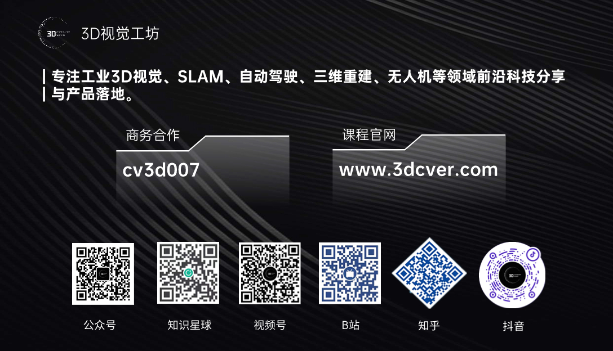

这里主要汇总计算机视觉、3D视觉、VSLAM、点云、三维重建、深度学习、结构光、机械臂抓取等方向的最新论文，主要来源：公众号【3D视觉工坊】、【计算机视觉工坊】、【3DCV】，及其他优秀公众号文章。

## 目录

[**一 3D视觉工坊最新论文汇总**](#3D视觉工坊最新论文汇总)

[**二 3D视觉精品课程汇总**](#3D视觉精品课程汇总)

[**三 加群**](#加群)

如果你想学习更多关于3D视觉、VSLAM、点云、三维重建、深度学习、结构光、机械臂抓取等，欢迎扫码加入我们的知识星球、共同学习学习，一起进步！

## 正文

## 一  3D视觉工坊最新论文汇总

 

主要来源：公众号|[3D视觉工坊](https://mp.weixin.qq.com/s/weShDMbGTf0amg1qu_t8cw) &知乎|[3D视觉工坊](https://www.zhihu.com/people/qiyong1993) &公众号「计算机视觉工坊」& 公众号「3DCV」

### 公众号最新论文汇总

详情请戳->[这里](paper/3D视觉工坊最新论文汇总.md)

### 基础知识

详情请戳->[这里](paper/基础知识.md)

主要涉及的方向包括：

- Linux嵌入式
- C++
- Python
- Cuda
- ROS
- Shell
- C语言
- Docker

### 工业3D视觉

详情请戳这里->[这里](paper/工业3D视觉.md)

主要包括以下一些方面：

- 面结构光
- 线结构光
- 机械臂抓取、
- 6D位姿估计
- 三维点云、
- 缺陷检测
- 手眼标定，
- 散斑三维重建
- 机械臂3D抓取
- Halcon在3D方向的应用
- 双目立体匹配
- QT界面编程
- 光场三维重建
- 干涉仪原理详解
- 阵列相机标定

### SLAM

详情请戳这里->[这里](paper/SLAM.md)

- 视觉SLAM
- 激光SLAM
- ORB-SLAM系列
- Vins-Fusion
- LeGo-LOAM
- LOAM
- Cartographer
- LVI-SAM
- gmapping
- LIO-SAM
- 手写一套视觉定位系统
- 手写一套激光-视觉-IMU多传感器融合定位系统
- cartographer
- 动态SLAM
- 卡尔曼滤波/粒子滤波算法与应用详解
- 事件相机
- VIO
- 语义分割
- MSCKF
- LIO-SAM
- FAST-LIO
- RTK/UWB/IMU/轮速计/TOF/激光雷达/气压计/毫米波雷达等硬件传感器原理讲解
- 语义SLAM
- iTOF
- 相机、IMU等传感器之间的标定

### 自动驾驶

详情请戳这里->[这里](paper/自动驾驶.md)

**感知**

- BEV感知算法
- Occupancy
- 车道线检测
- 毫米波雷达视觉感知融合
- 激光雷达感知算法

**定位**

- 自动驾驶中的SLAM定位
- 多传感器融合定位算法

**建图**

- 高精地图

**轨迹预测**

### 机器人导航

详情请戳这里->[这里](paper/机器人导航.md)

主要包括：

- A*
- DWA
- Dijkstra
- JPS
- D*
- Navigation2
- DWB
- Groot

### 三维重建

详情请戳这里->[这里](paper/三维重建.md)

主要包括：

- NeRF
- OpenMVS
- 纹理贴图
- MVSNet
- Colmap

### 无人机

详情请戳这里->[这里](paper/无人机.md)

主要包括：

- PID
- 四旋翼

### 事件相机

详情请戳这里->[这里](paper/事件相机.md)

### 求职招聘

详情请戳这里->[这里](paper/求职招聘.md)

## 二 3D视觉精品课程汇总

 

**3D视觉精品课程，涉及工业3D视觉、SLAM、和自动驾驶**，地址：[www.3dcver.com](www.3dcver.com)

一 科研论文写作

- [国内首个面向三维视觉的科研方法与学术论文写作教程](https://mp.weixin.qq.com/s?__biz=MzU1MjY4MTA1MQ==&mid=2247654939&idx=1&sn=c2d950c37fcffe1b2a990e100cdf37cc&scene=21#wechat_redirect)

基础课程：

- [面向三维视觉算法的C++重要模块精讲：从零基础入门到进阶](https://mp.weixin.qq.com/s?__biz=MzU1MjY4MTA1MQ==&mid=2247650268&idx=1&sn=263efd3573ec9dfa75c3771642c1dd5c&scene=21#wechat_redirect)

- [面向三维视觉的Linux嵌入式系统教程(理论+代码+实战)](https://mp.weixin.qq.com/s?__biz=MzkyMTUwMTU5Mg==&mid=2247485968&idx=1&sn=31b958be0b52d0e45583d80f5d77dc4b&scene=21#wechat_redirect)
- [如何学习相机模型与标定？（代码+实战）](https://mp.weixin.qq.com/s?__biz=MzU1MjY4MTA1MQ==&mid=2247617044&idx=1&sn=ad92441f2da47b01d3fa727785e2f49f&scene=21#wechat_redirect)
- [ROS2从入门到精通：理论与实战](https://mp.weixin.qq.com/s?__biz=MzU1MjY4MTA1MQ==&mid=2247593658&idx=1&sn=ecb325ba4986648660d10167e71a069c&scene=21#wechat_redirect)
- [彻底理解dToF雷达系统设计[理论+代码+实战]](https://mp.weixin.qq.com/s?__biz=MzU1MjY4MTA1MQ==&mid=2247654456&idx=2&sn=3ce00f1989769e27fc8f9a67e33e36f0&scene=21#wechat_redirect)

工业3D视觉方向课程：

- [（第二期）从零搭建一套结构光3D重建系统[理论+源码+实践]](https://mp.weixin.qq.com/s?__biz=MzU1MjY4MTA1MQ==&mid=2247649388&idx=1&sn=13634bd26dedeca5e16e22af6d8f6524&scene=21#wechat_redirect)
- [保姆级线结构光（单目&双目）三维重建系统教程](https://mp.weixin.qq.com/s?__biz=MzkyMTUwMTU5Mg==&mid=2247485968&idx=3&sn=c3be071365bd0821cbcff0d379567f3d&scene=21#wechat_redirect)
- [机械臂抓取从入门到实战课程（理论+源码）](https://mp.weixin.qq.com/s?__biz=MzU1MjY4MTA1MQ==&mid=2247648235&idx=4&sn=47f1d939b69c0f629d6742db1b634825&scene=21#wechat_redirect)
- [三维点云处理：算法与实战汇总](https://mp.weixin.qq.com/s?__biz=MzU1MjY4MTA1MQ==&mid=2247568678&idx=2&sn=018d0eaaa16c1789d5200103233237d9&scene=21#wechat_redirect)
- [彻底搞懂基于Open3D的点云处理教程！](https://mp.weixin.qq.com/s?__biz=MzU1MjY4MTA1MQ==&mid=2247647395&idx=1&sn=b1cc9e9bf51c8dd9d27a1a1d094a15c9&scene=21#wechat_redirect)
- [3D视觉缺陷检测教程：理论与实战！](https://mp.weixin.qq.com/s?__biz=MzU1MjY4MTA1MQ==&mid=2247608040&idx=2&sn=a6b1519c795c6bbead1a47815b2aeafa&scene=21#wechat_redirect)

SLAM方向课程:

- [深度剖析面向机器人领域的3D激光SLAM技术原理、代码与实战](https://mp.weixin.qq.com/s?__biz=MzkyMTUwMTU5Mg==&mid=2247484732&idx=2&sn=5adbf4f1ff4e8b8e2674b07520a8ea72&scene=21#wechat_redirect)
- [彻底剖析激光-视觉-IMU-GPS融合SLAM算法：理论推导、代码讲解和实战](https://mp.weixin.qq.com/s?__biz=MzU1MjY4MTA1MQ==&mid=2247577654&idx=1&sn=6a062c04d9c7593a8356ac9902ab5584&scene=21#wechat_redirect)
- [（第二期）彻底搞懂基于LOAM框架的3D激光SLAM：源码剖析到算法优化](https://mp.weixin.qq.com/s?__biz=MzU1MjY4MTA1MQ==&mid=2247601471&idx=1&sn=a7a506f252810e497dbfd47d3a1efaf2&scene=21#wechat_redirect)
- [彻底搞懂视觉-惯性SLAM：VINS-Fusion原理精讲与源码剖析](https://mp.weixin.qq.com/s?__biz=MzU1MjY4MTA1MQ==&mid=2247573467&idx=2&sn=e839e0b41d66eae28afb235f1dc746f0&scene=21#wechat_redirect)
- [彻底剖析室内、室外激光SLAM关键算法和实战(cartographer+LOAM+LIO-SAM)](https://mp.weixin.qq.com/s?__biz=MzU1MjY4MTA1MQ==&mid=2247591245&idx=1&sn=2209db0eb3152b1fd57d709d63a78497&scene=21#wechat_redirect)
- [（第二期）ORB-SLAM3理论讲解与代码精析](https://mp.weixin.qq.com/s?__biz=MzU1MjY4MTA1MQ==&mid=2247639431&idx=1&sn=cca2f053d103472501b8bdfe1d2a55b7&scene=21#wechat_redirect)

机器人导航与路径规划

- [移动机器人规划控制入门与实践：基于Navigation2](https://mp.weixin.qq.com/s?__biz=MzkyMTUwMTU5Mg==&mid=2247487420&idx=2&sn=b53ca65bca6e0a750d5fd348d37fdeec&scene=21#wechat_redirect)

视觉三维重建：

- [彻底搞透视觉三维重建：原理剖析、代码讲解、及优化改进](https://mp.weixin.qq.com/s?__biz=MzU1MjY4MTA1MQ==&mid=2247561631&idx=1&sn=630753b3f9f2073859ac959720e9ee19&scene=21#wechat_redirect)
- [基于深度学习的三维重建MVSNet系论文+源码+应用+科研\]](https://mp.weixin.qq.com/s?__biz=MzU1MjY4MTA1MQ==&mid=2247658291&idx=1&sn=dded78e1394d1721ea1fb3c4b1c76ad5&scene=21#wechat_redirect)

自动驾驶方向课程：

- [深度剖析面向自动驾驶领域的车载传感器空间同步（标定）](https://mp.weixin.qq.com/s?__biz=MzU1MjY4MTA1MQ==&mid=2247651878&idx=1&sn=c3b6c4803c7ca728bb542ec343ec5fc3&scene=21#wechat_redirect)
- [国内首个面向自动驾驶目标检测领域的Transformer原理与实战课程](https://mp.weixin.qq.com/s?__biz=MzU1MjY4MTA1MQ==&mid=2247654436&idx=3&sn=3453ce86716c4b67e61a07b2b9becd10&scene=21#wechat_redirect)
- [单目深度估计方法：算法梳理与代码实现](https://mp.weixin.qq.com/s?__biz=MzU1MjY4MTA1MQ==&mid=2247582082&idx=2&sn=cc10291ddfdf6b05bdae71887c7c819c&scene=21#wechat_redirect)
- [面向自动驾驶领域的3D点云目标检测全栈学习路线！(单模态+多模态/数据+代码)](https://mp.weixin.qq.com/s?__biz=MzU1MjY4MTA1MQ==&mid=2247580753&idx=1&sn=174f87726a07cc67247c528de0e924ca&scene=21#wechat_redirect)
- [如何将深度学习模型部署到实际工程中？（分类+检测+分割）](https://mp.weixin.qq.com/s?__biz=MzU1MjY4MTA1MQ==&mid=2247584979&idx=1&sn=6a9821711ee868337903c4f718b09077&scene=21#wechat_redirect)

无人机：

- [零基础入门四旋翼建模与控制(MATLAB仿真)[理论+实战]](https://mp.weixin.qq.com/s?__biz=MzU1MjY4MTA1MQ==&mid=2247656169&idx=1&sn=97d133bb083cea251e0d4f97254ccf54&scene=21#wechat_redirect)

最后

1、[3D视觉文章投稿作者招募](https://mp.weixin.qq.com/s?__biz=MzU1MjY4MTA1MQ==&mid=2247651198&idx=1&sn=7d16adaf3d02e5c1ed68d0e7a5eac5e1&scene=21#wechat_redirect)

2、[3D视觉课程（自动驾驶、SLAM和工业3D视觉）主讲老师招募](https://mp.weixin.qq.com/s?__biz=MzU1MjY4MTA1MQ==&mid=2247654172&idx=3&sn=25bde8b2604edc69123b95cf9f36a94c&scene=21#wechat_redirect)

3、[顶会论文分享与3D视觉传感器行业直播邀请](https://mp.weixin.qq.com/s?__biz=MzU1MjY4MTA1MQ==&mid=2247654576&idx=5&sn=998ede28f1836f66ab0632f8cf8348d1&scene=21#wechat_redirect)

更新于2023年11月30日。

作者：3D视觉工坊所有投稿作者，欢迎大家能够积极投稿，投稿请联系小助理微信：cv3d007，一经录用，稿费丰厚。

## 三 加群

 

目前工坊已经建立了3D视觉方向多个社群，包括SLAM、工业3D视觉、自动驾驶方向，细分群包括：

[**工业方向**]三维点云、结构光、机械臂、缺陷检测、三维测量、TOF、相机标定、综合群；

[**SLAM方向**]多传感器融合、ORB-SLAM、激光SLAM、机器人导航、RTK|GPS|UWB等传感器交流群、SLAM综合讨论群；

[**自动驾驶方向**]深度估计、Transformer、毫米波|激光雷达|视觉摄像头传感器讨论群、多传感器标定、自动驾驶综合群等。

[**三维重建方向**]NeRF、colmap、OpenMVS、MVSNet等。

[**无人机方向**]四旋翼建模、无人机飞控等。

除了这些，还有求职、硬件选型、视觉产品落地等交流群。

大家可以添加小助理微信: dddvisiona，备注：加群+方向+学校|公司, 小助理会拉你入群。

强烈推荐大家关注[3D视觉工坊](https://www.zhihu.com/people/qiyong1993)知乎和[3D视觉工坊](https://mp.weixin.qq.com/s/weShDMbGTf0amg1qu_t8cw)微信公众号，可以快速了解到最新优质的3D视觉论文。

